# Cấu hình sẵn sàng cao (HA) cho F5 BIG-IP trên nền tảng Viettel Cloud

## Giới thiệu tổng quan

Mô hình minh hoạ khi thiết lập cặp máy ảo F5 BIG-IP tương tự như sau:

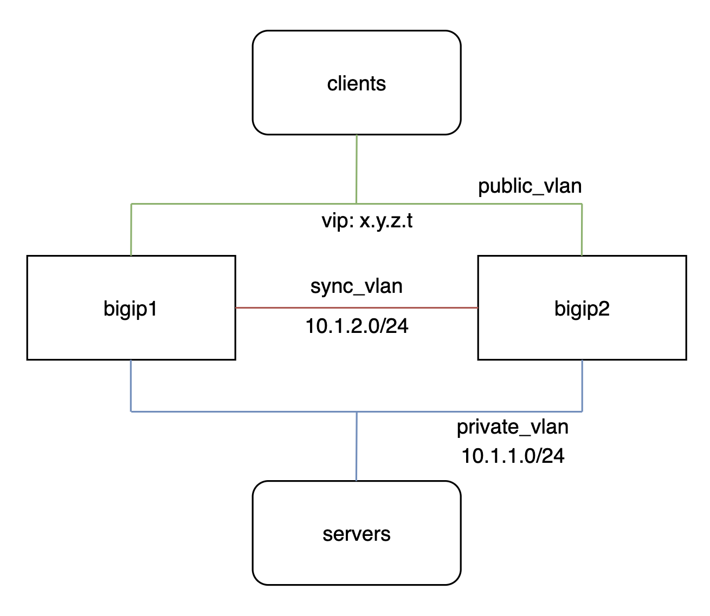

Về mặt giao diện mạng, dù không bắt buộc nhưng khuyến nghị có tối thiểu 3 giao diện (và tương ứng với nó trong ví dụ này là VLAN):

-  public_vlan (interface 1.0): để đón nhận lưu lượng mạng của người dùng cũng như các giao thức quản trị ban đầu (HTTPS, SSH). Nó cũng là VLAN chứa địa chỉ Virtual IP - VIP để client kết nối đến trong chế độ HA
- private_vlan (interface 1.1): để kết nối với server backend bên trong hệ thống
- sync_vlan (interface 1.2): là một giao diện dành riêng cho việc đồng bộ cấu hình, trao đổi heart-beat để failover cũng như đồng bộ phiên kết nối của client nếu cấu hình

## Hướng dẫn cấu hình

Trước hết, để hệ thống 
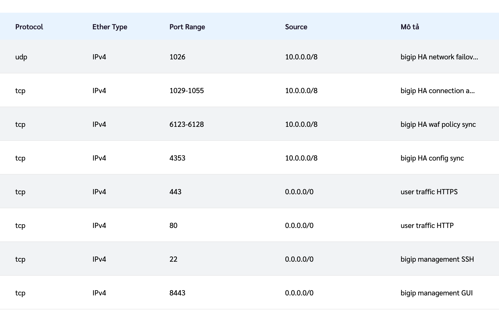

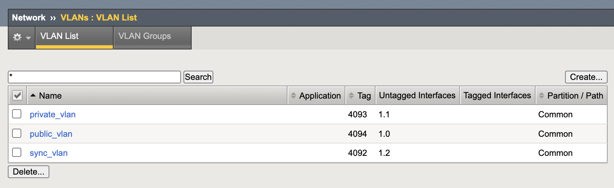

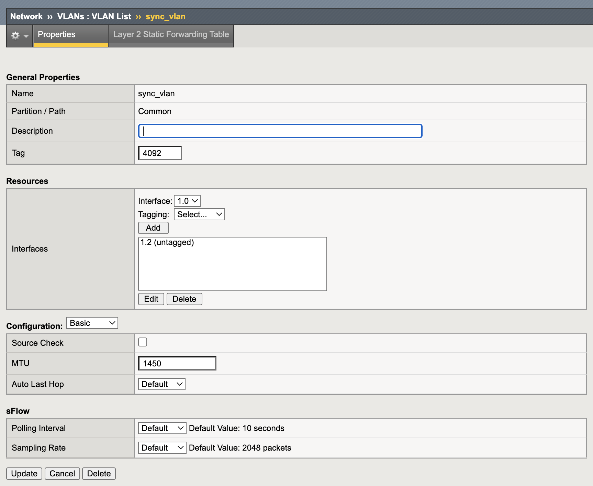

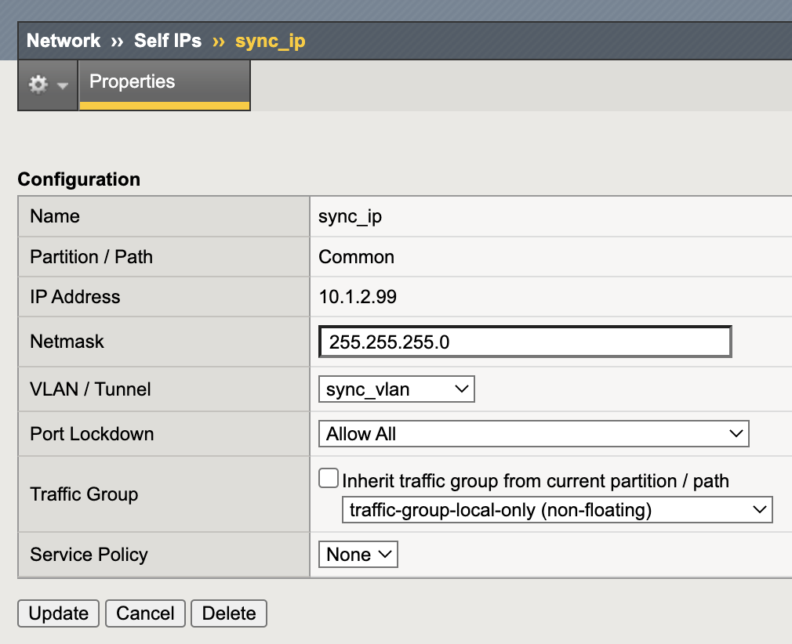

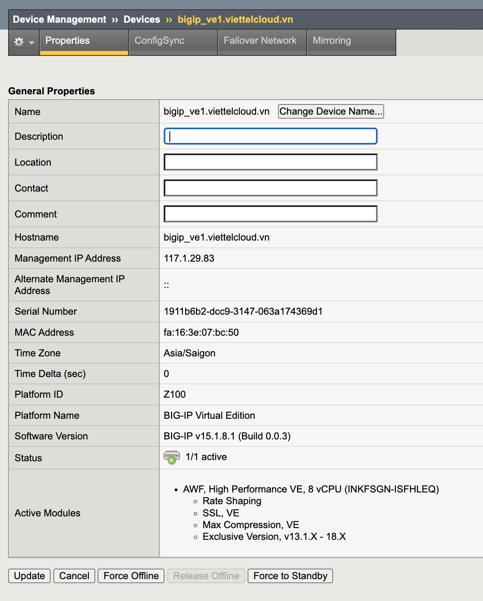

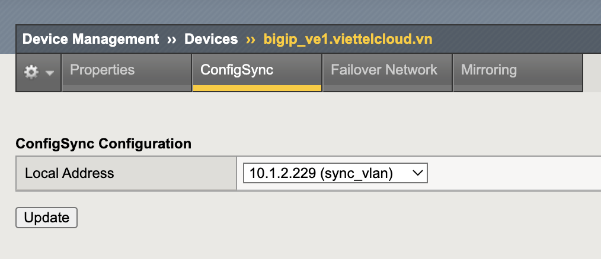

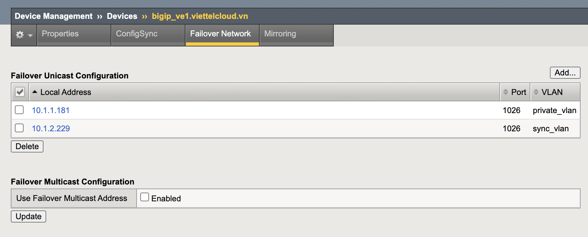

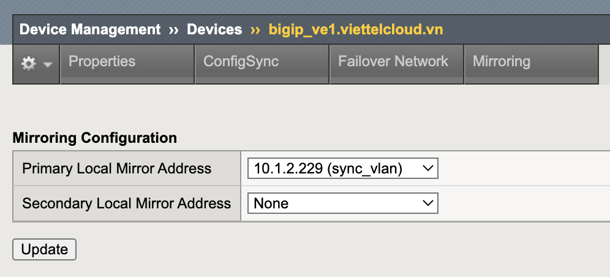

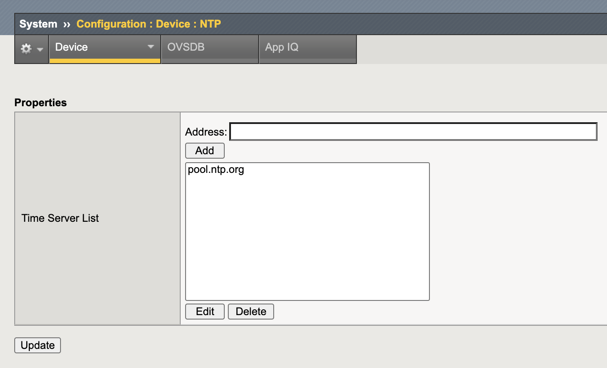

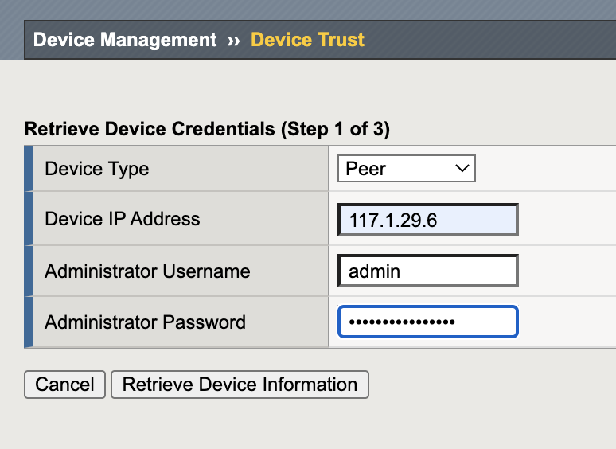

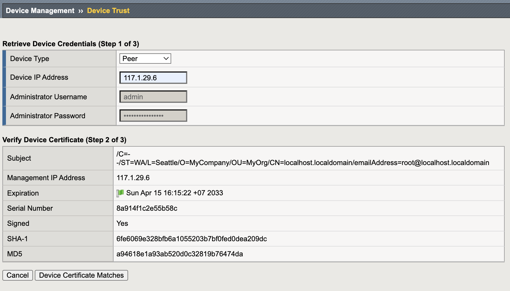

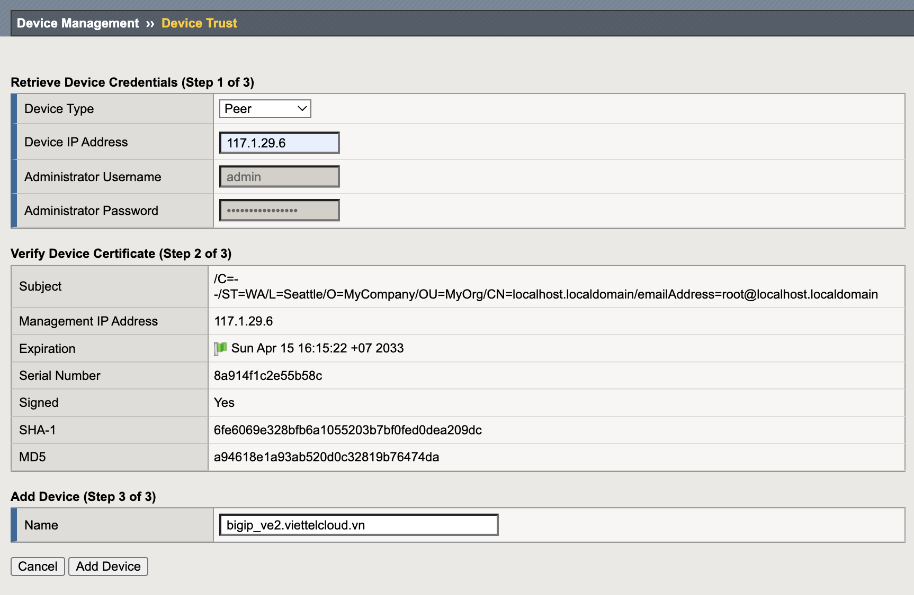

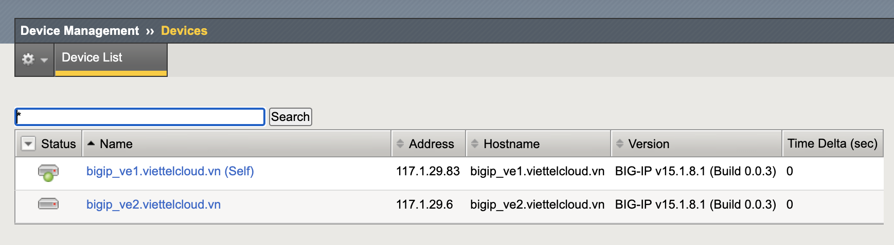

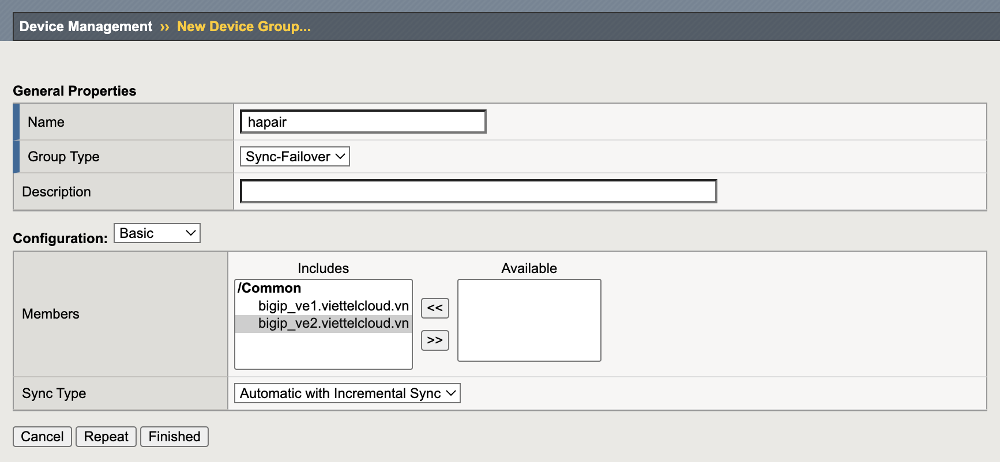

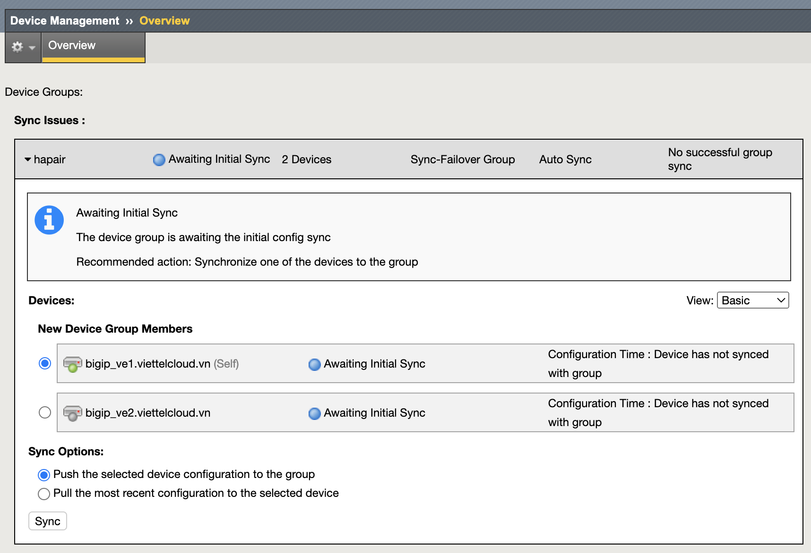

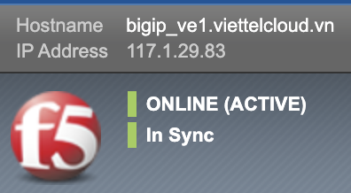

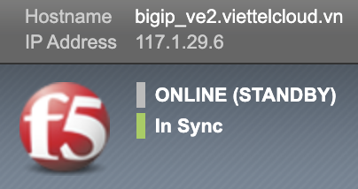

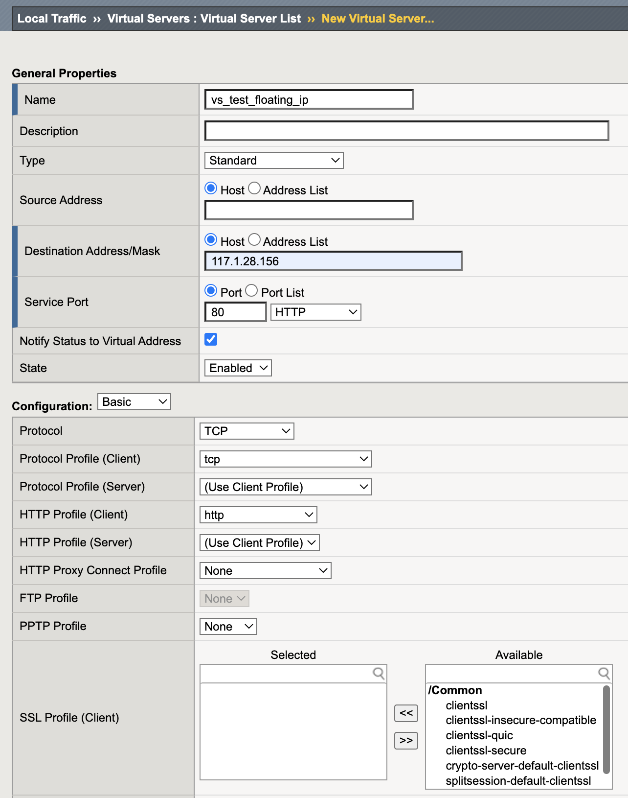

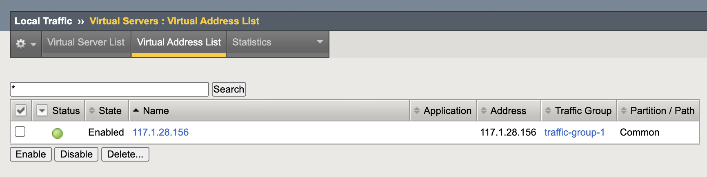

## Liên hệ hỗ trợ
Yêu cầu hỗ trợ kỹ thuật xin gửi đến địa chỉ: techsupport@viettelcloud.vn
