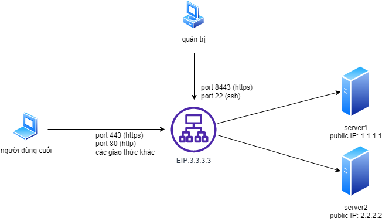
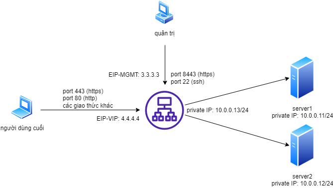
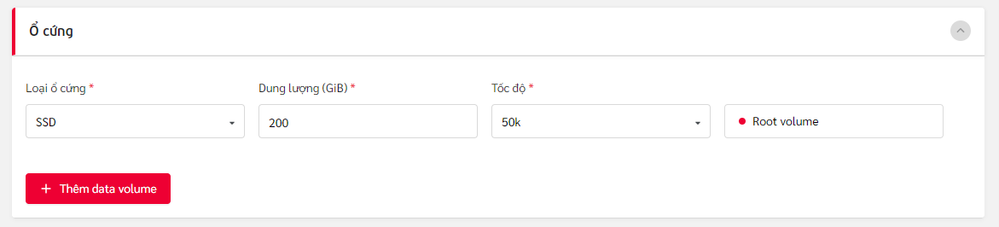
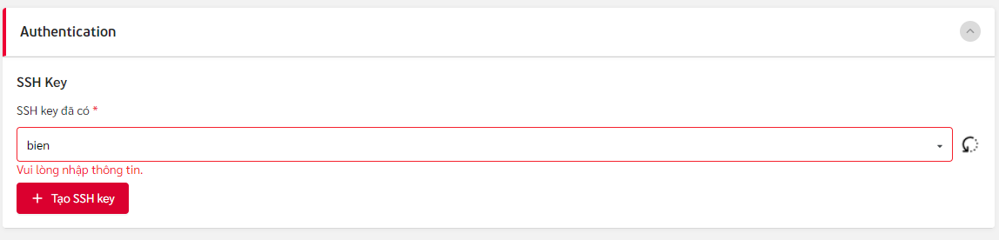
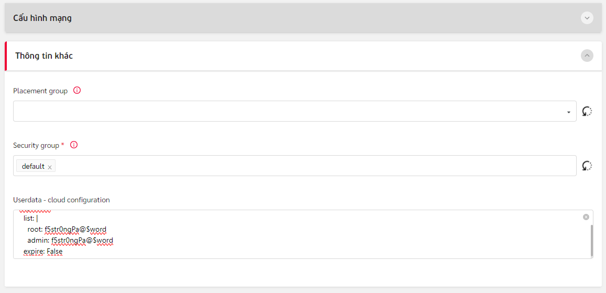

# Khởi tạo máy ảo F5 BIG-IP trên nền tảng Viettel Cloud

## Giới thiệu tổng quan
Trên nền tảng Viettel Cloud, các dịch vụ F5 Services như cân bằng tải, bảo vệ ứng dụng web và api, phòng chống DOS layer 7 và các dịch vụ khác nếu có trong tương lai đều được thực hiện thông qua các máy chủ ảo F5 BIG-IP. Đây là tài liệu hướng dẫn tạo lập máy ảo F5 BIG-IP và các cấu hình cơ bản để có thể khai thác các dịch vụ đó.

Các dịch vụ F5 Services có thể được triển khai theo 2 mô hình logic là:

1. Mô hình đơn card mạng - Single NIC
Hình vẽ dưới đây mô tả dạng triển khai thành phần cân bằng tải với 1 card mạng:



Thành phần cân bằng tải có duy nhất 1 địa chỉ IP public (ví dụ 3.3.3.3), thực hiện 3 vai trò cùng lúc:
(đây là mô hình mặc định khi vừa khởi tạo dịch vụ)

- Là địa chỉ IP quản trị, phục vụ các tác vụ quản trị theo giao thức SSH (port 22), giao diện web theo giao thức HTTPS (port 8443)
- Là địa chỉ IP dịch vụ để người dùng cuối kết nối đến (Virtual IP - VIP), thông thường là giao thức HTTP/HTTPS theo các port 80/443 tương ứng. Giải pháp cũng hỗ trợ đồng thời các dịch vụ theo giao thức khác như DNS (port 53 tcp/udp, port 389 LDAP, port 3306 MySQL.. tùy theo nhu cầu sử dụng)
- Là địa chỉ IP dùng để theo dõi, giám sát trạng thái dịch vụ/ứng dụng một cách chủ động. Nó cũng là địa chỉ mà thành phần cân bằng tải sử dụng để kết nối đến máy chủ đích

3. Mô hình đa card mạng - Multi NIC
Hình vẽ dưới đây mô tả dạng triển khai thành phần cân bằng tải với nhiều card mạng (ví dụ trong sơ đồ là 3 NIC):



Thành phần cân bằng tải có 3 NIC với 3 địa chỉ IP riêng biệt, thực hiện các vai trò khác nhau:
(đây là mô hình được tùy biến từ mô hình Single NIC, người quản trị dịch vụ cloud sẽ gán thêm các card mạng khác (EIP, Private IP) sau khi thành phần cân bằng tải được tạo lập)

* 3.3.3.3 là địa chỉ IP quản trị, phục vụ các tác vụ quản trị theo giao thức SSH (port 22), giao diện web theo giao thức HTTPS (port 443)
* 4.4.4.4 là địa chỉ IP dịch vụ để người dùng cuối kết nối đến (Virtual IP - VIP), thông thường là giao thức HTTP/HTTPS theo các port 80/443 tương ứng. Giải pháp cũng hỗ trợ đồng thời các dịch vụ theo giao thức khác như DNS (port 53 tcp/udp, port 389 LDAP, port 3306 MySQL.. tùy theo nhu cầu sử dụng). Tùy theo nhu cầu, có thể thêm một hoặc nhiều địa chỉ EIP như thế này vào 1 thành phần cân bằng tải.
* 10.0.0.13 là địa chỉ IP dùng để theo dõi, giám sát trạng thái dịch vụ/ứng dụng một cách chủ động. Tùy theo nhu cầu, có thể thêm một hoặc nhiều địa chỉ Private IP tương tự vào thành phần cân bằng tải. Nó cũng là địa chỉ mà thành phần cân bằng tải sử dụng để kết nối đến máy chủ đích

Mô hình này phù hợp với trường hợp khách hàng sử dụng các thành phần server ảo trên cùng nền tảng Viettel Cloud, nằm cùng VPC và chỉ có địa chỉ IP Private. Thành phần cân bằng tải lúc này có thể đóng phai trò như thiết bị bảo vệ cho các máy chủ (nó có thể đảm đương các nhiệm vụ như firewall mạng, firewall ứng dụng, chống ddos, chống bot.. tùy thuộc vào cách thức cấu hình và license đi kèm)

## Hướng dẫn cấu hình

### Khởi tạo máy ảo F5 BIG-IP
Đặt nhập vào Viettel Cloud Console, tạo mới Server với các thông tin như sau:

Thông tin chung về Region, tên server, loại máy chủ, cấu hình, loại hệ điều hành, version. Yêu cầu tối thiểu 8 vCPU, 16GB RAM:


Thông tin cho ổ đĩa cứng ảo. Yêu cầu ổ 200Gb SSD:



Chọn SSH Key để xác thực
(hiện tại chức năng này chưa được tích hợp đối với F5 BIG-IP)



Trong phần **Thông tin khác**, mục **Userdata-cloud configuration**, thiết lập mật khẩu cho tài khoản **root** và tài khoản **admin** (sử dụng cho quản trị qua giao diện dòng lệnh và giao diện đồ họa):



Ví dụ:
```
#cloud-config
chpasswd:
  list: |
    root:f5str0ngPa!$word
    admin:f5str0ngPa!$word
  expire: False

```

Tại các màn hình tiếp theo, xác nhận mọi thông tin đã đúng với yêu cầu, tiến hành khởi tạo máy ảo. Khi quá trình tạo hoàn tất, máy ảo ở trạng thái **Running**, ghi lại địa chỉ IP public được cấp cho máy ảo này để có thể quản trị qua SSH/HTTPS ở các bước tiếp theo.

### Kích hoạt license cho F5 BIG-IP
Đăng nhập vào máy ảo F5 BIG-IP qua giao diện SSH bằng tài khoản root (mật khẩu được chỉ định tại bước tạo máy):
```
ssh root@<địa chỉ IP quản trị>
```
Kiểm tra xem máy ảo này có thể kết nối ra ngoài Internet được không bằng cách:
- Thử truy vấn dns:
```
dig google.com
```

- Thử ping tới 8.8.8.8:
```
ping 8.8.8.8
```

Nếu cả 2 bước trên thành công, tiến hành bước kích hoạt license bằng lệnh sau:
```
SOAPLicenseClient --basekey FCKGK-JEDWV-KWYTT-RGIFL-SBVJNIN
```
(trong đó **FCKGK-JEDWV-KWYTT-RGIFL-SBVJNIN** chỉ là license key làm ví dụ minh họa)

Quá trình kích hoạt license có thể mất vài phút, hãy đợi đến khi dấu nhắc lệnh có chữ **Active**. Để thấy sự thay đổi thông tin này trong dấu nhắc lệnh, cần ấn phím **Enter**.

### Các cấu hình cơ bản cần thiết khác

Đăng nhập vào máy ảo F5 BIG-IP qua giao diện SSH bằng tài khoản root (mật khẩu được chỉ định tại bước tạo máy):
```
ssh root@<địa chỉ IP quản trị>
```

Cho phép tài khoản admin có thể đăng nhập SSH và sử dụng shell bash:
```
tmsh modify auth user admin shell bash
```

Disable tài khoản root (không cho root đăng nhập qua SSH vì lý do an toàn)
```
tmsh modify /sys db systemauth.disablerootlogin value true
```

Tắt cơ chế setup qua giao diện web ban đầu:
```
tmsh modify sys global-settings gui-setup disabled
```

Tắt cơ chế kiểm tra IP đối với module xác thực PAM:
```
tmsh modify /sys http auth-pam-validate-ip off
```

Bật các module (tùy thuộc vào license, tính năng cân bằng tải được bật mặc định). Ví dụ bật tính năng WAF, tính năng chống DDOS Layer 7:
```
tmsh modify sys provision asm level nominal
```
Việc bật/tắt các module tính năng như vậy sẽ khiến hệ thống khởi động lại một số tiến trình dịch vụ, chờ một vài phút trước khi tiếp tục.

Thiết lập múi giờ (tùy chọn, khuyến nghị nên đặt để tiện theo dõi):
```
tmsh modify /sys ntp timezone Asia/Saigon
```

Thiết lập hostname (tùy chọn, khuyến nghị nên đặt để tiện định danh theo quy ước chung)
```
tmsh modify /sys global-settings hostname bigip1.viettelcloud.vn
```

Cuối cùng, **lưu lại cấu hình** bằng lệnh:
```
tmsh save /sys config
```

Thoát khỏi phiên làm việc SSH bằng lệnh `exit`.

Như vậy, máy ảo F5 BIG-IP đã sẵn sàng để cấu hình các dịch vụ ứng dụng: cân bằng tải, tường lửa ứng dụng, phòng chống tấn công DOS layer 7.

## Liên hệ hỗ trợ
Yêu cầu hỗ trợ kỹ thuật xin gửi đến địa chỉ: techsupport@viettelcloud.vn
