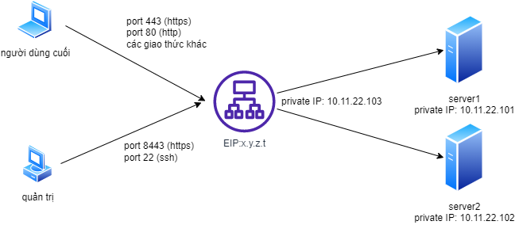

# Khởi tạo máy ảo F5 BIG-IP trên nền tảng Viettel Cloud

## Giới thiệu tổng quan
Trên nền tảng Viettel Cloud, các dịch vụ F5 Services như cân bằng tải, bảo vệ ứng dụng web và api, phòng chống DOS layer 7 và các dịch vụ khác nếu có trong tương lai đều được thực hiện thông qua các máy chủ ảo F5 BIG-IP. Đây là tài liệu hướng dẫn tạo lập máy ảo F5 BIG-IP và các cấu hình cơ bản để có thể khai thác các dịch vụ đó.

Các dịch vụ F5 Services có thể được triển khai theo 2 mô hình logic là:

1. Mô hình đơn card mạng - Single NIC
Hình vẽ dưới đây mô tả dạng triển khai thành phần cân bằng tải với 1 card mạng:

Thành phần cân bằng tải có duy nhất 1 địa chỉ IP public (ví dụ 3.3.3.3), thực hiện 3 vai trò cùng lúc:
(đây là mô hình mặc định khi vừa khởi tạo dịch vụ)

- Là địa chỉ IP quản trị, phục vụ các tác vụ quản trị theo giao thức SSH (port 22), giao diện web theo giao thức HTTPS (port 8443)
- Là địa chỉ IP dịch vụ để người dùng cuối kết nối đến (Virtual IP - VIP), thông thường là giao thức HTTP/HTTPS theo các port 80/443 tương ứng. Giải pháp cũng hỗ trợ đồng thời các dịch vụ theo giao thức khác như DNS (port 53 tcp/udp, port 389 LDAP, port 3306 MySQL.. tùy theo nhu cầu sử dụng)
- Là địa chỉ IP dùng để theo dõi, giám sát trạng thái dịch vụ/ứng dụng một cách chủ động. Nó cũng là địa chỉ mà thành phần cân bằng tải sử dụng để kết nối đến máy chủ đích

3. Mô hình đa card mạng - Multi NIC
Hình vẽ dưới đây mô tả dạng triển khai thành phần cân bằng tải với nhiều card mạng (ví dụ trong sơ đồ là 3 NIC):

Thành phần cân bằng tải có 3 NIC với 3 địa chỉ IP riêng biệt, thực hiện các vai trò khác nhau:
(đây là mô hình được tùy biến từ mô hình Single NIC, người quản trị dịch vụ cloud sẽ gán thêm các card mạng khác (EIP, Private IP) sau khi thành phần cân bằng tải được tạo lập)

* 3.3.3.3 là địa chỉ IP quản trị, phục vụ các tác vụ quản trị theo giao thức SSH (port 22), giao diện web theo giao thức HTTPS (port 443)
* 4.4.4.4 là địa chỉ IP dịch vụ để người dùng cuối kết nối đến (Virtual IP - VIP), thông thường là giao thức HTTP/HTTPS theo các port 80/443 tương ứng. Giải pháp cũng hỗ trợ đồng thời các dịch vụ theo giao thức khác như DNS (port 53 tcp/udp, port 389 LDAP, port 3306 MySQL.. tùy theo nhu cầu sử dụng). Tùy theo nhu cầu, có thể thêm một hoặc nhiều địa chỉ EIP như thế này vào 1 thành phần cân bằng tải.
* 10.0.0.13 là địa chỉ IP dùng để theo dõi, giám sát trạng thái dịch vụ/ứng dụng một cách chủ động. Tùy theo nhu cầu, có thể thêm một hoặc nhiều địa chỉ Private IP tương tự vào thành phần cân bằng tải. Nó cũng là địa chỉ mà thành phần cân bằng tải sử dụng để kết nối đến máy chủ đích

Mô hình này phù hợp với trường hợp khách hàng sử dụng các thành phần server ảo trên cùng nền tảng Viettel Cloud, nằm cùng VPC và chỉ có địa chỉ IP Private. Thành phần cân bằng tải lúc này có thể đóng phai trò như thiết bị bảo vệ cho các máy chủ (nó có thể đảm đương các nhiệm vụ như firewall mạng, firewall ứng dụng, chống ddos, chống bot.. tùy thuộc vào cách thức cấu hình và license đi kèm)

## Hướng dẫn cấu hình

## Liên hệ hỗ trợ
Yêu cầu hỗ trợ kỹ thuật xin gửi đến địa chỉ: techsupport@viettelcloud.vn
