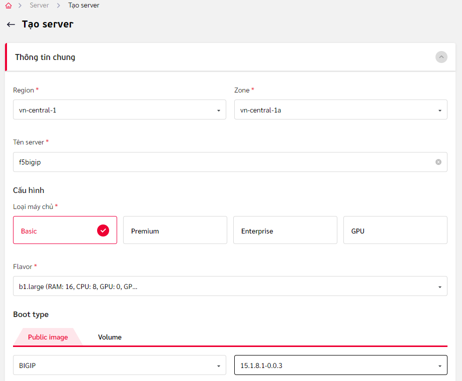

# Khởi tạo máy ảo F5 BIG-IP trên nền tảng Viettel Cloud

## Giới thiệu tổng quan
Trên nền tảng Viettel Cloud, các dịch vụ F5 Services như cân bằng tải, bảo vệ ứng dụng web và api, phòng chống DOS layer 7 và các dịch vụ khác nếu có trong tương lai đều được thực hiện thông qua các máy chủ ảo F5 BIG-IP. Đây là tài liệu hướng dẫn tạo lập máy ảo F5 BIG-IP và các cấu hình cơ bản để có thể khai thác các dịch vụ đó.

Các dịch vụ F5 Services có thể được triển khai theo 2 mô hình logic là:

1. Mô hình đơn card mạng - Single NIC
Hình vẽ dưới đây mô tả dạng triển khai thành phần cân bằng tải với 1 card mạng:


Thành phần cân bằng tải có duy nhất 1 địa chỉ IP public (ví dụ 3.3.3.3), thực hiện 3 vai trò cùng lúc:
(đây là mô hình mặc định khi vừa khởi tạo dịch vụ)

- Là địa chỉ IP quản trị, phục vụ các tác vụ quản trị theo giao thức SSH (port 22), giao diện web theo giao thức HTTPS (port 8443)
- Là địa chỉ IP dịch vụ để người dùng cuối kết nối đến (Virtual IP - VIP), thông thường là giao thức HTTP/HTTPS theo các port 80/443 tương ứng. Giải pháp cũng hỗ trợ đồng thời các dịch vụ theo giao thức khác như DNS (port 53 tcp/udp, port 389 LDAP, port 3306 MySQL.. tùy theo nhu cầu sử dụng)
- Là địa chỉ IP dùng để theo dõi, giám sát trạng thái dịch vụ/ứng dụng một cách chủ động. Nó cũng là địa chỉ mà thành phần cân bằng tải sử dụng để kết nối đến máy chủ đích

3. Mô hình đa card mạng - Multi NIC
Hình vẽ dưới đây mô tả dạng triển khai thành phần cân bằng tải với nhiều card mạng (ví dụ trong sơ đồ là 2 NIC):


Thành phần cân bằng tải có 2 NIC với 2 địa chỉ IP riêng biệt, thực hiện các vai trò khác nhau:

* x.y.z.t là địa chỉ IP public (EIP), để người dùng và người quản trị kết nối đến

* 10.11.22.103 là địa chỉ IP private (Private IP), để BIG-IP kết nối tới các máy chủ ảo dịch vụ trong cùng Subnet với nó.

Mô hình này phù hợp với trường hợp khách hàng sử dụng các thành phần server ảo trên cùng nền tảng Viettel Cloud, nằm cùng VPC và chỉ có địa chỉ IP Private. Thành phần cân bằng tải lúc này có thể đóng phai trò như thiết bị bảo vệ cho các máy chủ (nó có thể đảm đương các nhiệm vụ như firewall mạng, firewall ứng dụng, chống ddos, chống bot.. tùy thuộc vào cách thức cấu hình và license đi kèm)

## Hướng dẫn cấu hình

### Khởi tạo máy ảo F5 BIG-IP - với trường hợp Single NIC
Đặt nhập vào Viettel Cloud Console, tạo mới Server với các thông tin như sau:

Thông tin chung về Region, tên server, loại máy chủ, cấu hình, loại hệ điều hành, version. Yêu cầu tối thiểu 8 vCPU, 16GB RAM:



Thông tin cho ổ đĩa cứng ảo. Yêu cầu ổ 200Gb SSD:


Chọn SSH Key để xác thực
(hiện tại chức năng này chưa được tích hợp đối với F5 BIG-IP)


Trong phần **Thông tin khác**, mục **Userdata-cloud configuration**, thiết lập mật khẩu cho tài khoản **root** và tài khoản **admin** (sử dụng cho quản trị qua giao diện dòng lệnh và giao diện đồ họa):


Ví dụ:
```
#cloud-config
chpasswd:
  list: |
    root:f5str0ngPa!$word
    admin:f5str0ngPa!$word
  expire: False

```

Tại các màn hình tiếp theo, xác nhận mọi thông tin đã đúng với yêu cầu, tiến hành khởi tạo máy ảo. Khi quá trình tạo hoàn tất, máy ảo ở trạng thái **Running**, ghi lại địa chỉ IP public được cấp cho máy ảo này để có thể quản trị qua SSH/HTTPS ở các bước tiếp theo.

### Kích hoạt license cho F5 BIG-IP
Đăng nhập vào máy ảo F5 BIG-IP qua giao diện SSH bằng tài khoản root (mật khẩu được chỉ định tại bước tạo máy):
```
ssh root@<địa chỉ IP quản trị>
```
Kiểm tra xem máy ảo này có thể kết nối ra ngoài Internet được không bằng cách:
- Thử truy vấn dns:
```
dig google.com
```

- Thử ping tới 8.8.8.8:
```
ping 8.8.8.8
```

Nếu cả 2 bước trên thành công, tiến hành bước kích hoạt license bằng lệnh sau:
```
SOAPLicenseClient --basekey FCKGK-JEDWV-KWYTT-RGIFL-SBVJNIN
```
(trong đó **FCKGK-JEDWV-KWYTT-RGIFL-SBVJNIN** chỉ là license key làm ví dụ minh họa)

Quá trình kích hoạt license có thể mất vài phút, hãy đợi đến khi dấu nhắc lệnh có chữ **Active**. Để thấy sự thay đổi thông tin này trong dấu nhắc lệnh, cần ấn phím **Enter**.

### Các cấu hình cơ bản cần thiết khác

Đăng nhập vào máy ảo F5 BIG-IP qua giao diện SSH bằng tài khoản root (mật khẩu được chỉ định tại bước tạo máy):
```
ssh root@<địa chỉ IP quản trị>
```

Cho phép tài khoản admin có thể đăng nhập SSH và sử dụng shell bash:
```
tmsh modify auth user admin shell bash
```

Disable tài khoản root (không cho root đăng nhập qua SSH vì lý do an toàn)
```
tmsh modify /sys db systemauth.disablerootlogin value true
```

Tắt cơ chế setup qua giao diện web ban đầu:
```
tmsh modify sys global-settings gui-setup disabled
```

Tắt cơ chế kiểm tra IP đối với module xác thực PAM:
```
tmsh modify /sys http auth-pam-validate-ip off
```

Bật các module (tùy thuộc vào license, tính năng cân bằng tải được bật mặc định). Ví dụ bật tính năng WAF, tính năng chống DDOS Layer 7:
```
tmsh modify sys provision asm level nominal
```
Việc bật/tắt các module tính năng như vậy sẽ khiến hệ thống khởi động lại một số tiến trình dịch vụ, chờ một vài phút trước khi tiếp tục.

Thiết lập múi giờ (tùy chọn, khuyến nghị nên đặt để tiện theo dõi):
```
tmsh modify /sys ntp timezone Asia/Saigon
```

Cuối cùng, **lưu lại cấu hình** bằng lệnh:
```
tmsh save /sys config
```

Thoát khỏi phiên làm việc SSH bằng lệnh `exit`.

Như vậy, máy ảo F5 BIG-IP đã sẵn sàng để cấu hình các dịch vụ ứng dụng: cân bằng tải, tường lửa ứng dụng, phòng chống tấn công DOS layer 7.


### Hướng dẫn khởi tạo và cấu hình F5 BIG-IP trong trường hợp có 2 NIC
#### Tạo trước địa chỉ IP Private và EIP

Sử dụng Viettel Cloud Console, chọn dịch vụ **Network**. Vào mục **Subnet** --> **Private IP** --> **Thêm Private IP**. Sau đó nhập vào địa chỉ IP Private muốn tạo (lưu ý rằng địa chỉ này không được trùng với các địa chỉ khác đã được cấp phát/gán trong cùng Subnet đó)

Tương tự, trong phần dịch vụ **Network**, vào mục **Elastic IP** --> **Cấp phát Elastic IP**

Ghi nhớ 2 địa chỉ này (ví dụ ở đây là 117.1.28.13 cho địa chỉ EIP và 10.11.22.101 cho địa chỉ Private IP)

#### Tạo máy ảo F5 BIG-IP với phần tùy chọn "Cấu hình mạng",
Chọn **Enable Elastic IP**, chọn **Elastic IP** là địa chỉ vừa tạo ở bước trước

Chọn **Enable Private IP**, chọn đúng VPC, Subnet và **Interface** là địa chỉ IP Private vừa tạo ở bước trước.


Các phần khác làm tương tự như cho trường hợp Single NIC

#### Cấu hình cơ bản cho F5 BIG-IP trong trường hợp 2 NIC

Sau khi máy ảo khởi động xong, truy cập qua SSH bằng tài khoản root:

```
ssh root@<địa chỉ IP quản trị>
```
Sau đó thực hiện chuỗi các lệnh sau:
```
tmsh modify sys db provision.1nicautoconfig value disable
tmsh modify sys db provision.1nic value forced_enable
tmsh modify sys httpd ssl-port 8443
tmsh modify net self-allow defaults add { tcp:8443 }
tmsh save sys config
```
Khởi động lại máy ảo bằng lệnh `reboot`

Đợi cho máy ảo hoàn tất việc khởi động lại, tiếp tục thực hiện các bước sau trên giao diện Bash shell qua SSH với tài khoản root:

Kiểm tra danh sách các Interface bằng lệnh `tmsh list net interface`

Kết quả tương tự như sau:
```
net interface 1.0 {
    if-index 48
    mac-address fa:16:3e:86:ea:1e
    media-fixed 10000T-FD
    media-max auto
    mtu 9198
}
net interface 1.1 {
    if-index 64
    mac-address fa:16:3e:3a:a8:31
    media-fixed 10000T-FD
    media-max auto
    mtu 9198
}
net interface mgmt {
    if-index 32
    mac-address fa:16:3e:86:ea:1e
    media-active 100TX-FD
}
```
Cần đối chiếu địa chỉ MAC của 1.0 và mgmt xem có trùng với MAC của interface gắn với EIP không (xem trên Viettel Cloud Console)

Cần đối chiếu địa chỉ MAC của 1.1 xem có trùng với MAC của interface gắn với Private IP không (xem trên Viettel Cloud Console)

Nếu sai thì xem lại quá trình tạo máy ảo, tạo IPs và không nên tiếp tục thực hiện các bước bên dưới.

Nếu đúng, tiếp tục thực hiện các bước sau:

Kích hoạt license bằng lệnh `SOAPLicenseClient --basekey <license key>`

Đợi quá trình kích hoạt license hoàn tất, tiếp tục thực hiện:

Tạo VLAN public và gán EIP vào VLAN này:

```
tmsh create net vlan public_vlan interfaces add { 1.0 { untagged } }
tmsh create net self public_ip address 117.1.28.13/23 vlan public_vlan allow-service default
```

Tạo VLAN private và gán Private IP vào VLAN này:
```
tmsh create net vlan private_vlan interfaces add { 1.1 { untagged } }
tmsh create net self private_ip address 10.11.22.101/24 vlan private_vlan
```

Kiểm tra xem default route đang là địa chỉ nào bằng lệnh:
```
tmsh list sys management-route
```
Kết quả tương tự như sau:
```
sys management-route default {
    description configured-by-dhcp
    gateway 117.1.29.254
    network default
}
```
Lấy địa chỉ này gán cho BIG-IP bằng lệnh:
```
tmsh create net route default gw 117.1.29.254
```

Các bước sau tương tự như đối với trường hợp Single-NIC:
```
tmsh modify sys global-settings mgmt-dhcp disabled
tmsh modify auth user admin shell bash
tmsh modify /sys db systemauth.disablerootlogin value true
tmsh modify sys global-settings gui-setup disabled
tmsh modify /sys http auth-pam-validate-ip off
tmsh modify /sys global-settings hostname bigip1.viettelcloud.vn
tmsh modify /sys ntp timezone Asia/Saigon
```

Có thể bật tắt các module tính năng nếu muốn, ví dụ bật module ASM (cho dịch vụ WAF/Layer 7 DDOS):
```
tmsh modify sys provision asm level nominal
```

Cuối cùng, lưu cấu hình lại và khởi động lại:
```
tmsh save sys config
reboot
```
(Lưu ý: từ phiên đăng nhập SSH tiếp theo, sử dụng tài khoản admin thay vì root)

## Liên hệ hỗ trợ
Yêu cầu hỗ trợ kỹ thuật xin gửi đến địa chỉ: techsupport@viettelcloud.vn
