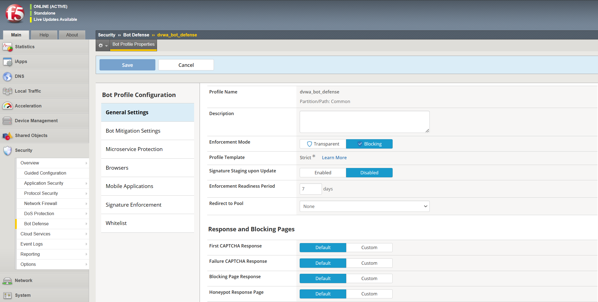
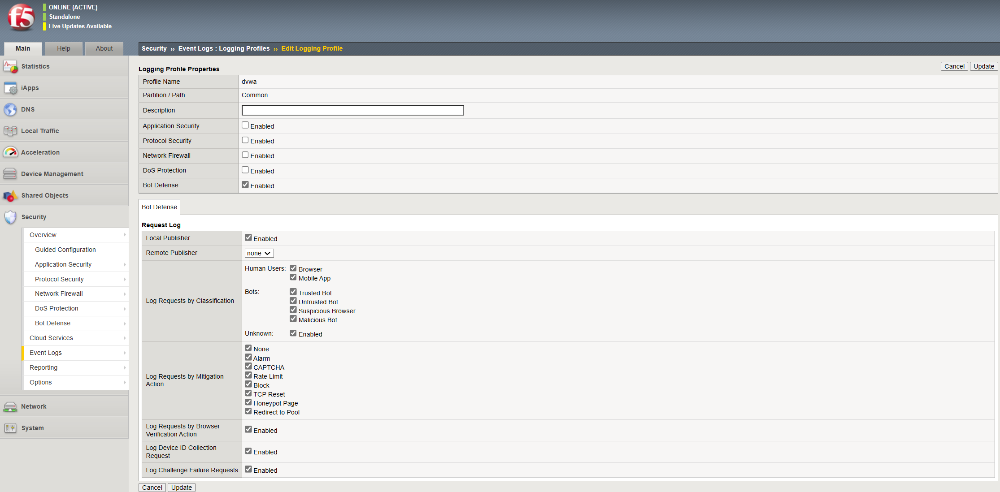
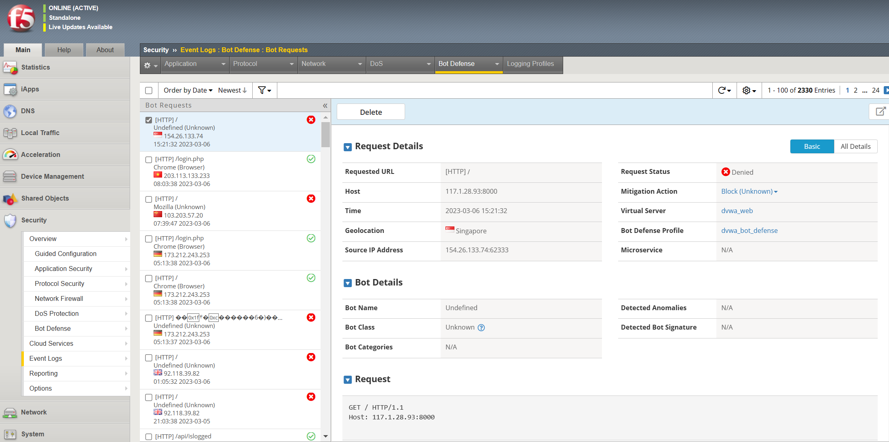

# CẤU HÌNH LƯU LOG CÁC VI PHẠM

## Hướng dẫn cấu hình 

### Tạo một profile chống bot
1. Trên Main tab, chọn `Security` > `Bot Defense` > `Bot Defense Profile`
2. Chọn `Create`. Sau đó bảng cấu hình `Bot Profile Configuration` sẽ hiển thị trên tab `General Settings`
3. Nhập `Profile Name` và chọn `Save`

Sau khi cấu hình profile chống bot, chúng ta phải gán tới một máy chủ ảo để bắt đầu bảo vệ lưu lượng mạng

### Gán một profile chống bot tới một máy chủ ảo
1. Trên Main tab, chọn `Security` > `Event Logs` > `Logging Profiles` > `Create New Logging Profile`
2. Chọn `Create` và nhập `Profile Name`. Sau đó bật tính năng `Bot Defense`
3. Trong tab `Bot Defense`, bật các loại log thu thập mong muốn.

5. Chọn `Create` để lưu cấu hình
6. Trên Main tab, chọn `Local Traffic` > `Virtual Server` > `Virtual Server List` và chọn máy chủ ảo để liên kết tới profile chống BOT
7. Chọn `Security` > `Policies`
8. Trong bảng Policy Settings, mục Bot Defense Profile, chọn `Enabled` và chọn profile chống bot từ menu

10. Chọn `Update` để lưu Policy Settings

### Xem lưu lượng và các sự kiện log vi phạm

Chúng ta có thể xem lưu lượng chống bot bằng cách chọn `Security` > `Event Logs` > `Bot Defense` > `Bot Traffic` hoặc `Security` > `Event Logs` > `Bot Defense` > `Bot Request`

## Liên hệ hỗ trợ
Yêu cầu hỗ trợ kỹ thuật xin gửi đến địa chỉ: techsupport@viettelcloud.vn
