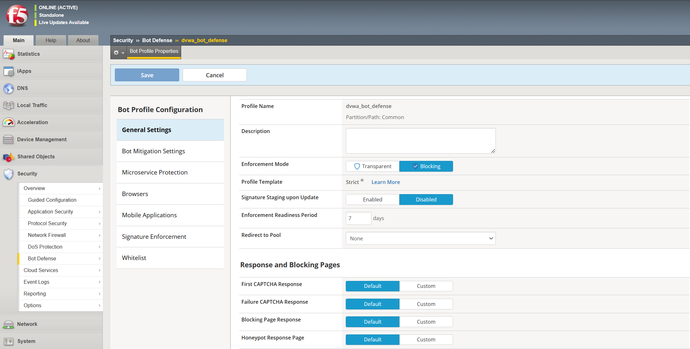
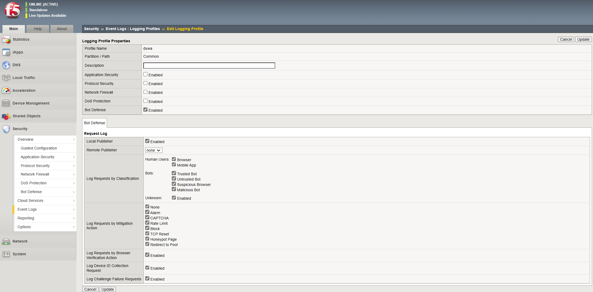
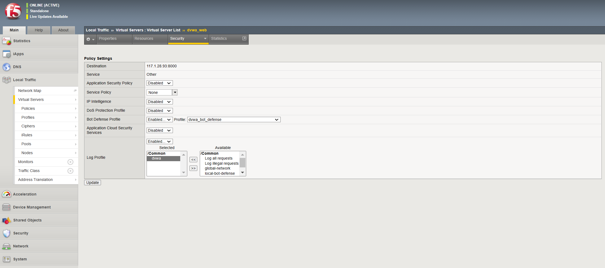
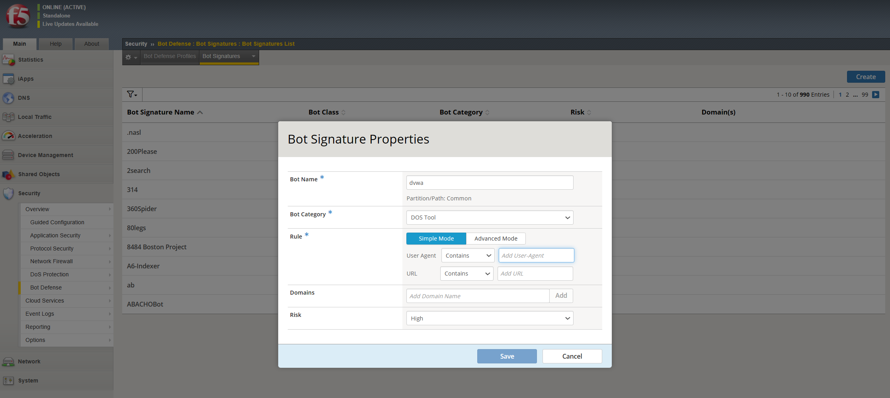
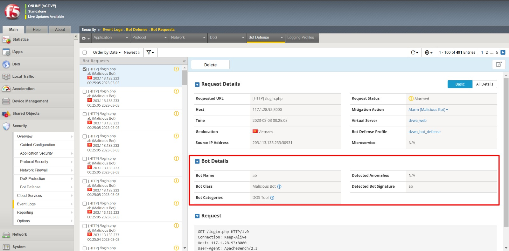
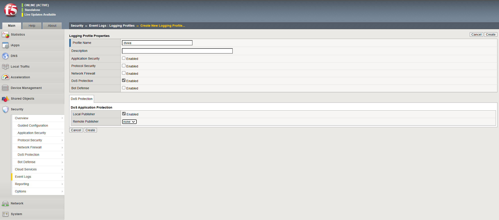

# I. CẤU HÌNH LƯU LOG CÁC VI PHẠM

## Hướng dẫn cấu hình 

### Tạo một profile chống bot
1. Trên Main tab, chọn `Security` > `Bot Defense` > `Bot Defense Profile`
2. Chọn `Create`. Sau đó bảng cấu hình `Bot Profile Configuration` sẽ hiển thị trên tab `General Settings`
3. Nhập `Profile Name` và chọn `Save`

Sau khi cấu hình profile chống bot, chúng ta phải gán tới một máy chủ ảo để bắt đầu bảo vệ lưu lượng mạng

### Gán một profile chống bot tới một máy chủ ảo
1. Trên Main tab, chọn `Security` > `Event Logs` > `Logging Profiles` > `Create New Logging Profile`
2. Chọn `Create` và nhập `Profile Name`. Sau đó bật tính năng `Bot Defense`
3. Trong tab `Bot Defense`, bật các loại log thu thập mong muốn.

5. Chọn `Create` để lưu cấu hình
6. Trên Main tab, chọn `Local Traffic` > `Virtual Server` > `Virtual Server List` và chọn máy chủ ảo để liên kết tới profile chống bot
7. Chọn `Security` > `Policies`
8. Trong bảng Policy Settings, mục Bot Defense Profile, chọn `Enabled` và chọn profile chống bot từ menu

10. Chọn `Update` để lưu Policy Settings

### Xem lưu lượng và các sự kiện log vi phạm

Chúng ta có thể xem lưu lượng chống bot bằng cách chọn `Security` > `Event Logs` > `Bot Defense` > `Bot Traffic` hoặc `Security` > `Event Logs` > `Bot Defense` > `Bot Request`

# II. THIẾT LẬP CƠ CHẾ CHỐNG BOT DỰA VÀO SIGNATURE

## Giới thiệu tổng quan

Bot Signature xác định rô-bốt web bằng cách tìm kiếm các mẫu cụ thể trong các header của các bản tin HTTP request đi đến. Phát hiện bot DoS Lớp 7 bao gồm nhiều dấu hiệu xác định bot và chúng ta cũng có thể tạo dấu hiệu của riêng mình để bảo vệ bot tùy chỉnh.

Khả năng phân loại bot cho phép hành xử khác nhau với bot theo các cách khác nhau. Chúng ta có thể báo cáo, chặn hoặc không làm gì khi dấu hiệu khớp với bot độc hại hoặc không độc hại. Hơn nữa, các bot độc hại và không độc hại rơi vào các danh mục dấu hiệu bot cụ thể hơn có thể được xử lý khi cần thiết. Chúng ta có thể tạo danh mục mới nếu cần cho dấu hiệu bot tùy chỉnh.

## Hướng dẫn cấu hình

### Cấu hình bot signature

1. Trên main tab, chọn `Security` > `Bot Defense` > `Bot Signatures` > `Bot Signatures List`
Màn hình sẽ hiển thị thư viện các dấu hiệu được tạo sẵn thuộc các phân loại khác nhau. 

2. Chúng ta có thể tạo thêm các dấu hiệu với cấu hình tùy chỉnh bằng cách chọn `Create`. Trên màn hình sẽ hiển thị bảng cấu hình chi tiết

### Tạo profile bot 

1. Trên Main tab, chọn `Security` > `Bot Defense` > `Bot Defense Profile`
2. Chọn `Create`. Sau đó bảng cấu hình `Bot Profile Configuration` sẽ hiển thị trên tab `General Settings`
3. Chọn mục `Signature Enforcement` để hiển thị tất cả các `Bot Signature` 

### Gán profile chống bot tới máy chủ ảo

1. Trên Main tab, chọn `Local Traffic` > `Virtual Server` > `Virtual Server List` và chọn máy chủ ảo để liên kết tới profile chống bot
2. Chọn `Security` > `Policies`
3. Trong bảng Policy Settings, mục Bot Defense Profile, chọn `Enabled` và chọn profile chống bot từ menu

4. Chọn `Update` để lưu Policy Settings

### Kiểm tra kết quả 

1. Chúng ta có thể xem các log chống bot bằng cách chọn `Security` > `Event Logs` > `Bot Defense` > `Bot Request`

# III. THIẾT LẬP CƠ CHẾ CHỐNG BOT DỰA VÀO HÀNH VI

## Giới thiệu tổng quan

Behavioral DoS (BADoS) cung cấp khả năng bảo vệ tự động chống lại các cuộc tấn công DDoS bằng cách phân tích hành vi lưu lượng bằng cách sử dụng máy học và phân tích dữ liệu. Hoạt động cùng với các biện pháp bảo vệ BIG-IP DoS khác, Behavioral DoS kiểm tra lưu lượng giữa máy khách và máy chủ ứng dụng trong trung tâm dữ liệu và tự động thiết lập cấu hình lưu lượng/luồng cơ sở cho Lớp 7 (HTTP) và Lớp 3 và 4.

Ví dụ: trong trường hợp tấn công DDoS từ mạng botnet, mỗi yêu cầu có thể hoàn toàn hợp pháp nhưng nhiều yêu cầu cùng lúc có thể làm chậm hoặc sập máy chủ. Behavioral DoS có thể giảm thiểu cuộc tấn công bằng cách làm chậm lưu lượng không cần thiết để giữ cho máy chủ hoạt động tốt.

Behavioral DoS liên tục theo dõi tình trạng và tải của máy chủ, thông qua vòng phản hồi của khách hàng, để đảm bảo mối tương quan trong thời gian thực, đồng thời xác thực các điều kiện, cuộc tấn công và biện pháp giảm thiểu của máy chủ. Mọi sự bất thường tiếp theo sẽ được theo dõi và hệ thống sẽ áp dụng các biện pháp giảm nhẹ (làm chậm hoặc chặn) khi cần.

Đây là cách hoạt động của Behavioral DoS:
+ Học các hành vi điển hình của lưu lượng bình thường
+ Phát hiện một cuộc tấn công dựa trên các điều kiện hiện tại (sức khỏe của máy chủ)
+ Tìm hành vi bất thường (cái gì và ai đã thay đổi gây ra tắc nghẽn?)
+ Phòng chống bằng cách làm chậm các truy cập máy trạm đáng ngờ
+ Cải tiến dựa trên kinh nghiệm trong quá trình hoạt động

Bật DoS theo hành vi, yêu cầu cấu hình tối thiểu, trong cấu hình DoS trong cài đặt phát hiện dựa trên căng thẳng(stress-based). Do hệ thống đang theo dõi dữ liệu lưu lượng truy cập nên hệ thống sẽ thích ứng với các điều kiện thay đổi và không có ngưỡng để chỉ định. Chúng ta cần đặt mức phòng chống muốn thực hiện, từ không phòng chống(chỉ học) đến bảo vệ tích cực (bảo vệ DoS chủ động). Hệ thống có thể nhanh chóng phát hiện các cuộc tấn công DoS lớp 7, mô tả lưu lượng truy cập vi phạm và giảm thiểu cuộc tấn công.

## Hướng dẫn cấu hình

### Tạo DoS profile dựa vào hành vi

1. Trên main tab, chọn `DoS Protection` > `Protection Profiles` > `Create`
2. Nhập tên cho profile. Sau đó, dưới mục `Application Security`, chọn `Behavioral & Stress-based Detection`
Trên màn hình sẽ hiển thị bảng cấu hình chi tiết 

Operation mode: Xác định chế độ hoạt động cho tính năng bảo vệ dos. Các tùy chọn bao gồm: **Blocking, Transparent, Off**. Blocking có nghĩa là tính năng sẽ phát hiện, báo cáo và phòng chống. Transparent có nghĩa là tính năng sẽ phát hiện, báo cáo, nhưng sẽ không phòng chống. Tắt có nghĩa là tính năng bị tắt.

Threshold mode: Xác định cách Tường lửa ứng dụng web nâng cao lấy được các ngưỡng để sử dụng trong việc phát hiện thành phần TPS của một cuộc tấn công stress-based. Các tùy chọn bao gồm:
  + Manual: Quản trị viên khai báo cấu hình TPS và ngưỡng tỷ lệ phần trăm dựa trên kiến thức của quản trị viên về môi trường hoặc các yêu cầu cụ thể.
  + Automatic: Tường lửa ứng dụng web nâng cao tự động giám sát tốc độ lưu lượng truy cập và tính toán các ngưỡng dựa trên lưu lượng truy cập thông thường đến ứng dụng.

Stress-based Detection Options: Tường lửa ứng dụng web nâng cao có thể kích hoạt một cuộc tấn công nếu bất kỳ/tất cả các phương pháp phát hiện sau vượt quá ngưỡng được xác định hoặc tính toán cho phương pháp phát hiện:
  + By Source IP: IP nguồn cụ thể đã vượt quá ngưỡng được xác định.
  + By Device ID: Một thiết bị cụ thể đã vượt quá ngưỡng được xác định. ID thiết bị là ASM tính toán dấu vân tay cho một thiết bị nhất định. Tính năng này yêu cầu chèn Javascript để hoạt động bình thường. Tuy nhiên, tính năng này mang lại lợi ích trong việc phát hiện một thiết bị cụ thể, ngay cả khi cuộc tấn công thay đổi địa chỉ IP nguồn của nó.
  + By Geolocation: Một quốc gia/vị trí địa lý đã vượt quá ngưỡng được xác định.
  + By URL: Yêu cầu lưu lượng truy cập đến một cụ thể (hoặc tập hợp URL được xác định trong phần mẫu URL của hồ sơ DoS) đã vượt quá ngưỡng được xác định.
  + Site Wide: Yêu cầu lưu lượng truy cập vào toàn bộ trang web đã vượt quá ngưỡng được xác định và cuộc tấn công không được phát hiện bằng bất kỳ tiêu chí phát hiện nào khác. Site Wide được coi là phương pháp cuối cùng.

Behavioral Detection and Mitigation
  + Bad Actors Behavior Detection: Xác định xem công cụ Behavioral DoS có theo dõi và cố gắng xác định các tác nhân xấu góp phần vào một tập hợp lưu lượng độc hại nhất định hay không. Khi **Bad Actor Behavior Detection** được bật, sau khi Tường lửa Ứng dụng Web Nâng cao phát hiện sự căng thẳng của máy chủ và xác định một tập hợp lưu lượng độc hại góp phần vào sự căng thẳng của máy chủ, thì công cụ Behavioral DoS sau đó sẽ cố gắng xác định địa chỉ IP nguồn nào đang tạo ra lưu lượng độc hại và bao nhiêu phần trăm lưu lượng truy cập độc hại mà một tác nhân xấu đang tạo ra. Các tác nhân xấu được phòng chống ở tầng vận chuyển thông qua các kỹ thuật phòng chống làm chậm và tốc độ phòng chống tác nhân xấu có liên quan trực tiếp đến tỷ lệ phần trăm tạo ra của chúng vào nhóm lưu lượng độc hại và chế độ phòng chống được chọn.
  + Request Signature Detection: Xác định xem công cụ Behavioral DoS có cố gắng tạo dấu hiệu để chặn lưu lượng bất thường hay không. Tính năng DoS của tường lửa ứng dụng Web nâng cao ở trạng thái học hỏi, luôn theo dõi các yêu cầu ứng dụng và quá trình xây dựng các yêu cầu này. Khi tính năng **Request Signatures Detection** được bật, sau khi tường lửa ứng dụng web nâng cao phát hiện căng thẳng của máy chủ, nó sẽ xác định các đặc điểm lưu lượng đã sai lệch so với đường cơ sở. Nếu có các đặc điểm sai lệch, thì công cụ Behavioral DoS sẽ tự động tạo ra một dấu hiệu dựa trên các đặc điểm sai lệch này để chặn lưu lượng dị thường.
  + Use Approved Signatures Only: Theo mặc định, khi tính năng **Request Signatures Detection** được bật, tường lửa ứng dụng web nâng cao sẽ tạo và sử dụng các dấu hiệu tấn công được tạo động như được xác định bởi lựa chọn chế độ phòng chống. Bằng cách bật tùy chọn này, quản trị viên sẽ ghi đè hành vi này và buộc thực hiện một bước thủ công để xem xét và phê duyệt dấu hiệu trước khi bất kỳ biện pháp phòng chống nào có hiệu lực. Dấu hiệu có thể được xem xét từ GUI tường lửa ứng dụng web nâng cao thông qua Bảo mật -> Bảo vệ DoS -> Dấu hiệu.
 
Mitigation: Xác định chế độ giảm thiểu cho DoS hành vi tường lửa ứng dụng web nâng cao. Các tùy chọn bao gồm:
  + No Mitigation
      + Giám sát lưu lượng truy cập, tạo dấu hiệu và xác định các tác nhân xấu nhưng không thực hiện bất kỳ biện pháp giảm thiểu nào.
  + Conservative Protection
      + Nếu Phát hiện Hành vi Tác nhân Xấu được bật, làm chậm các tác nhân xấu được xác định.
      + Nếu Phát hiện dấu hiệu yêu cầu được bật, hãy chặn các yêu cầu khớp với dấu hiệu tấn công
  + Standard Protection
      + Nếu Phát hiện Hành vi Tác nhân Xấu được bật, làm chậm các tác nhân xấu được xác định.
      + Nếu Phát hiện dấu hiệu yêu cầu được bật, hãy chặn các yêu cầu khớp với dấu hiệu tấn công
      + Tỷ lệ giới hạn tất cả các yêu cầu dựa trên tình trạng máy chủ
      + Giới hạn số lượng kết nối đồng thời từ các địa chỉ IP của tác nhân xấu
      + Nếu cần, hãy giới hạn số lượng tất cả các kết nối đồng thời dựa trên tình trạng của máy chủ
  + Aggressive Protection
      + Nếu **Bad Actors Behavior Detection** được bật, làm chậm các tác nhân xấu.
      + Nếu **Request Signatures Detection** được bật, hãy chặn các yêu cầu khớp với dấu hiệu tấn công
      + Giới hạn tỉ lệ tất cả các yêu cầu dựa trên tình trạng máy chủ
      + Giới hạn số lượng kết nối đồng thời từ các địa chỉ IP của tác nhân xấu
      + Nếu cần, hãy giới hạn số lượng tất cả các kết nối đồng thời dựa trên tình trạng của máy chủ
      + Proactively thực hiện tất cả các hành động bảo vệ, ngay cả trước khi phát hiện tấn công, tăng tác động của các kỹ thuật bảo vệ.

3. Sau khi hoàn thành cấu hình, chọn `Finished`

### Tạo log profile 

1. Trên main tab, chọn `Event logs` > `Logging Profiles` 
2. Chọn `Create` và nhập `Profile Name`. Sau đó tìm tới mục `DoS Protection` và tích chọn Enabled

3. Chọn `Create` để hoàn thành cấu hình tạo log profile

### Gán DoS Profile và Log Profile tới máy chủ ảo và 

1. Trên Main tab, chọn `Local Traffic` > `Virtual Server` > `Virtual Server List` và chọn máy chủ ảo để liên kết tới DoS profile dựa trên hành vi
2. Chọn `Security` > `Policies`
3. Trong bảng Policy Settings, mục DoS Protection Profile, chọn `Enabled` và chọn DoS profile từ menu

4. Chọn Log Profile từ cột Available chuyển sang cột Selected để thực hiện đẩy log 

5. Chọn `Update` để hoàn thành cấu hình

# IV. THIẾT LẬP CƠ CHẾ CHỐNG DOS CHỦ ĐỘNG 

## Giới thiệu tổng quan

Chúng ta có thể bảo vệ các ứng dụng web của mình trước lưu lượng bot Internet bằng cách định cấu hình cấu hình DoS và bật các tính năng Bot Signature Checking và Proactive Bot Defense. Sau đó, chúng ta có thể liên kết trực tiếp cấu hình DoS với máy chủ ảo của mình. Khi cấu hình tính năng Proactive Bot Defense, hệ thống sẽ sử dụng JavaScript để đánh giá dấu hiệu của bot và xác định xem các trình duyệt truy cập trang web của bạn có hợp pháp hay không. Khi cấu hình tính năng Bot Signature Checking, hệ thống sẽ phân tích chuỗi user-agent trong HTTP Header để tìm tên miền của bot. Sau đó, hệ thống ASM thực hiện tra cứu DNS ngược trên tên miền và xác định các bot là hợp pháp hay độc hại.

## Hướng dẫn cấu hình

1. Trên Main tab, chọn `Security` > `Bot Defense` > `Bot Defense Profile`
2. Chọn `Create` để tạo bot profile và nhập bot profile
3. Chọn mục `Browser` để cấu hình proactive bot defense

Browser Access: Nhiều ứng dụng máy chủ dành riêng cho ứng dụng di động và không dành cho truy cập trình duyệt. Do đó, các trình duyệt truy cập các ứng dụng di động này thường do những kẻ tấn công điều khiển và nên bị chặn. Giá trị mặc định là cho phép(Allow).

Browser Verification: Chỉ định nội dung và thời điểm hệ thống gửi thử thách.
  + None: Hệ thống không thực hiện xác minh JavaScript và Header-based. Tuy nhiên, một số phát hiện bất thường (chẳng hạn như Session Opening) vẫn xảy ra.
  + Challenge-Free Verification: Giá trị mặc định khi **Profile Template** được đặt thành Relaxed. Hệ thống thực hiện xác minh Header-based nhưng không thực hiện xác minh JavaScript.
  + Verify Before Access: Giá trị mặc định khi **Profile Template** được đặt thành Strict. Hệ thống sẽ gửi một trang trắng có JavaScript để thử thách truy cập. Nếu máy khách không vượt qua thử thách, hệ thống sẽ thực hiện hành động phòng chống đã cấu hình và báo cáo sự bất thường. Nếu máy khách vượt qua thử thách, hệ thống sẽ chuyển tiếp yêu cầu đến máy chủ.
  + Verify After Access (Blocking): Giá trị mặc định khi **Profile Template** được đặt thành Balanced. Hệ thống đưa ra một thử thách JavaScript trong phản hồi của máy chủ trước khi gửi phản hồi cho máy khách. Nếu máy khách không vượt qua thử thách, hệ thống sẽ thực hiện hành động phòng chống đã cấu hình và báo cáo sự bất thường. Nếu khách hàng vượt qua thử thách, hệ thống sẽ chuyển tiếp yêu cầu đến máy chủ.
  + Verify After Access (Detection Only): Hệ thống đưa thử thách JavaScript vào phản hồi của máy chủ trước khi gửi phản hồi cho máy khách. Nếu máy khách không vượt qua thử thách, hệ thống chỉ báo cáo sự bất thường nhưng không thực hiện bất kỳ hành động phòng chống nào. Nếu khách hàng vượt qua thử thách, hệ thống sẽ chuyển tiếp yêu cầu đến máy chủ.

  
Device ID Mode: Mã định danh duy nhất mà BIG-IP ASM tạo bằng cách gửi JavaScript để lấy thông tin về thiết bị khách. Giá trị mặc định cho cài đặt này được xác định bởi lựa chọn của bạn trong **Profile Template** (trong General Settings). Chúng ta nên sử dụng các giá trị mặc định được đặt bởi **Profile Template** đã chọn trừ khi có các yêu cầu ứng dụng cụ thể.
  + None: Giá trị mặc định khi **Profile Template** được đặt thành Relaxed. Hệ thống không gửi JavaScript để thu thập ID thiết bị
  + Generate After Access: Giá trị mặc định khi **Profile Template** được đặt thành Balanced. Hệ thống đưa JavaScript vào phản hồi của máy chủ trước khi chuyển tiếp đến máy khách. Điều này ít xâm phạm hơn và ít ảnh hưởng đến độ trễ hơn.
  + Generate Before Access: Giá trị mặc định khi **Profile Template** được đặt thành Strict. Hệ thống gửi thử thách JavaScript tới máy khách trước khi chuyển tiếp yêu cầu của máy khách tới máy chủ. Điều này đảm bảo rằng mọi yêu cầu đến máy chủ đều có ID thiết bị. Điều này có nhiều tác động về độ trễ hơn so với tùy chọn trước đó. Hệ thống chặn các bot cố gắng thể hiện mình là trình duyệt nhưng không thể thực hiện thử thách JavaScript.

Verification and Device-ID Challenges in Transparent Mode: Mặc định là **Tắt**. Khi được bật, hệ thống sẽ gửi thử thách JavaScript và kiểm tra xác minh cho khách hàng, mặc dù Chế độ thực thi (trong General Settings) được đặt thành Transparent.

Single Page Application: Khi ứng dụng web tải nội dung mới mà không kích hoạt tải lại toàn bộ trang, nó được coi là Ứng dụng một trang (SPA). Khi được bật, hệ thống sẽ đưa các thử thách JavaScript vào mọi phản hồi, do đó gửi nhiều thử thách khác nhau (chẳng hạn như xác minh trình duyệt, ID thiết bị và CAPTCHA) mà không yêu cầu tải lại trang. Mặc định là **Tắt**.

Cross Domain Requests:
  + Allow all requests: Cho phép các yêu cầu đối với các tài nguyên không phải HTML sau khi chúng vượt qua thử thách cookie chuyển hướng của hệ thống. Đây là giá trị mặc định.
  + Allow configured domains; validate in bulk: Cho phép yêu cầu đối với các tài nguyên không phải HTML nếu miền trong tiêu đề người giới thiệu khớp với miền được định cấu hình trong cài đặt Miền trang web có liên quan hoặc Miền bên ngoài có liên quan. Hệ thống tìm nạp cookie từ các miền được định cấu hình trước trong cài đặt **Related Site Domains**. Đề xuất tùy chọn này nếu ứng dụng của bạn có nhiều tài nguyên tên miền chéo.
  + Allow configured domains; validate upon request: Cho phép yêu cầu đối với các tài nguyên không phải HTML nếu miền trong referer header khớp với miền được cấu hình trong cài đặt Related Site Domains hoặc Related External Domains. Hệ thống tìm nạp cookie từ các miền được cấu hình trong cài đặt **Related Site Domains** trong thời gian thực khi chúng được yêu cầu. Đề xuất tùy chọn này nếu ứng dụng của bạn không có nhiều tài nguyên tên miền chéo.

4. Chọn `Save` để lưu cấu hình

### Gán profile chống bot tới máy chủ ảo

1. Trên Main tab, chọn `Local Traffic` > `Virtual Server` > `Virtual Server List` và chọn máy chủ ảo để liên kết tới bot defense profile 
2. Chọn `Security` > `Policies`
3. Trong bảng Policy Settings, mục Bot Defense Profile, chọn `Enabled` và chọn bot defense profile từ menu
4. Chọn Log Profile từ cột Available chuyển sang cột Selected để thực hiện đẩy log 

5. Chọn `Update` để hoàn thành cấu hình

## V. LIÊN HỆ HỖ TRỢ
Yêu cầu hỗ trợ kỹ thuật xin gửi đến địa chỉ: techsupport@viettelcloud.vn

