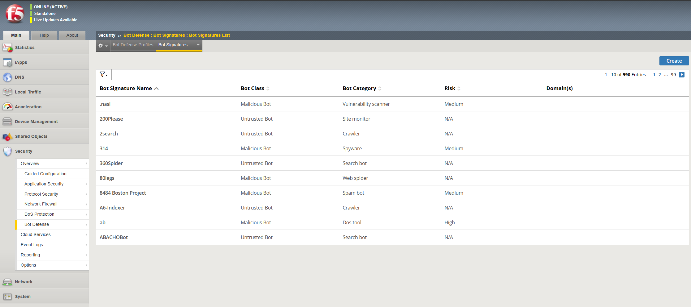
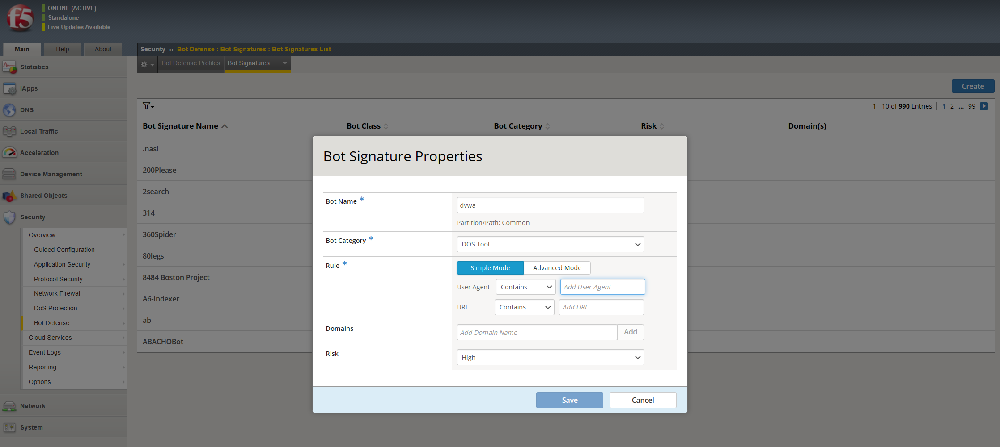
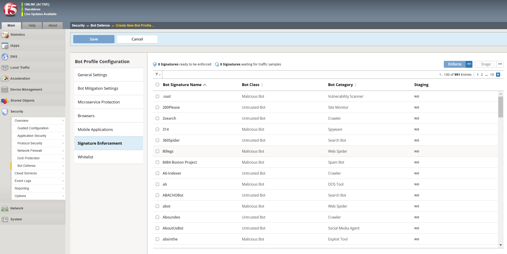
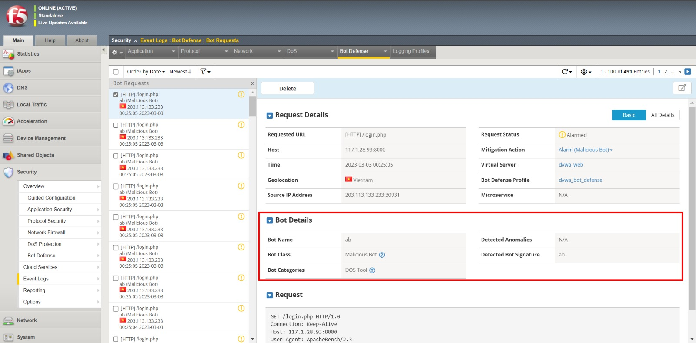

# THIẾT LẬP CƠ CHẾ CHỐNG BOT DỰA VÀO SIGNATURE

## Giới thiệu tổng quan

Bot Signature xác định rô-bốt web bằng cách tìm kiếm các mẫu cụ thể trong các header của các bản tin HTTP request đi đến. Phát hiện bot DoS Lớp 7 bao gồm nhiều dấu hiệu xác định bot và chúng ta cũng có thể tạo dấu hiệu của riêng mình để bảo vệ bot tùy chỉnh.

Khả năng phân loại bot cho phép hành xử khác nhau với bot theo các cách khác nhau. Chúng ta có thể báo cáo, chặn hoặc không làm gì khi dấu hiệu khớp với bot độc hại hoặc không độc hại. Hơn nữa, các bot độc hại và không độc hại rơi vào các danh mục dấu hiệu bot cụ thể hơn có thể được xử lý khi cần thiết. Chúng ta có thể tạo danh mục mới nếu cần cho chữ ký bot tùy chỉnh.

## Hướng dẫn cấu hình

### Cấu hình bot signature

1. Trên main tab, chọn `Security` > `Bot Defense` > `Bot Signatures` > `Bot Signatures List`
Màn hình sẽ hiển thị thư viện các dấu hiệu được tạo sẵn thuộc các phân loại khác nhau. 

2. Chúng ta có thể tạo thêm các dấu hiệu với cấu hình tùy chỉnh bằng cách chọn `Create`. Trên màn hình sẽ hiển thị bảng cấu hình chi tiết

### Tạo profile bot 

1. Trên Main tab, chọn `Security` > `Bot Defense` > `Bot Defense Profile`
2. Chọn `Create`. Sau đó bảng cấu hình `Bot Profile Configuration` sẽ hiển thị trên tab `General Settings`
3. Chọn mục `Signature Enforcement` để hiển thị tất cả các BOT Signature 

### Gán profile chống bot tới máy chủ ảo

1. Trên Main tab, chọn `Local Traffic` > `Virtual Server` > `Virtual Server List` và chọn máy chủ ảo để liên kết tới profile chống BOT
2. Chọn `Security` > `Policies`
3. Trong bảng Policy Settings, mục Bot Defense Profile, chọn `Enabled` và chọn profile chống BOT từ menu

4. Chọn `Update` để lưu Policy Settings

### Kiểm tra kết quả 

1. Chúng ta có thể xem các log chống BOT bằng cách chọn `Security` > `Event Logs` > `Bot Defense` > `Bot Request`

## Liên hệ hỗ trợ
Yêu cầu hỗ trợ kỹ thuật xin gửi đến địa chỉ: techsupport@viettelcloud.vn
