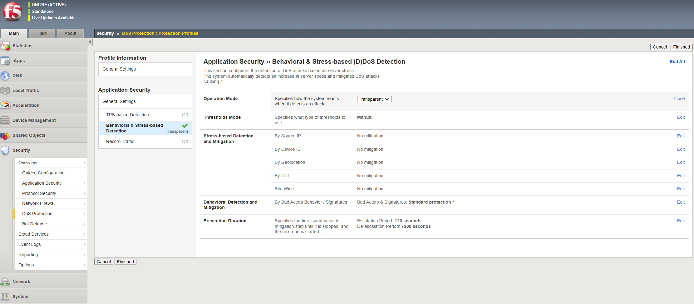
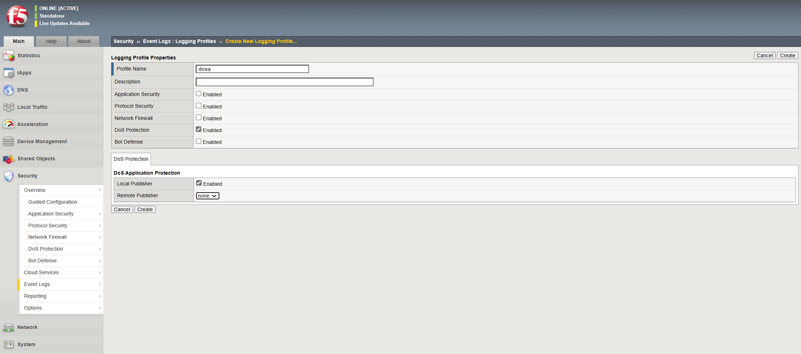
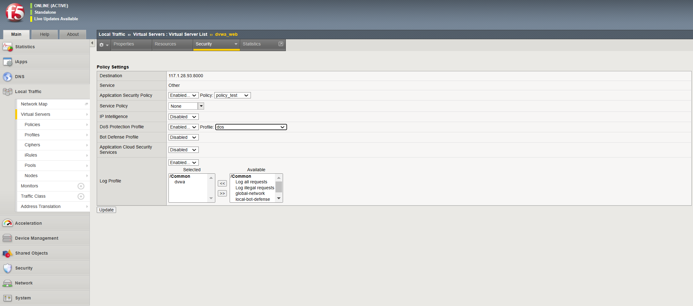
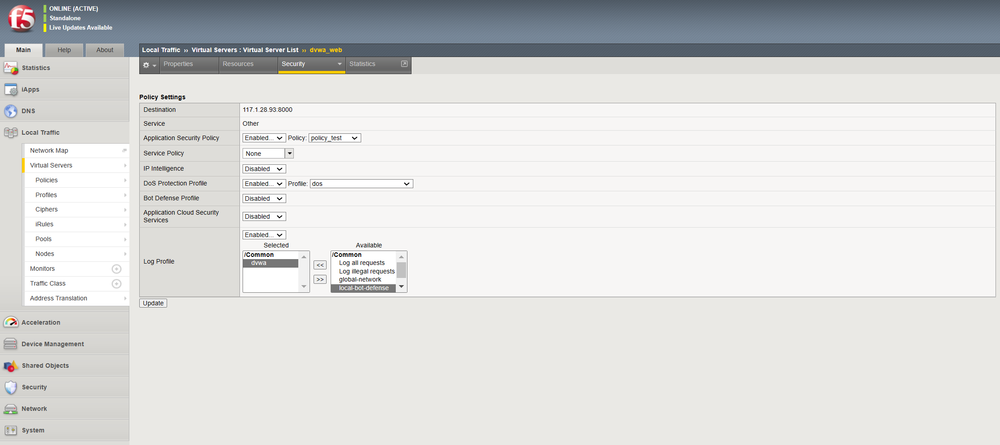

# THIẾT LẬP CƠ CHẾ CHỐNG BOT DỰA VÀO HÀNH VI

## Giới thiệu tổng quan

Behavioral DoS (BADoS) cung cấp khả năng bảo vệ tự động chống lại các cuộc tấn công DDoS bằng cách phân tích hành vi lưu lượng bằng cách sử dụng máy học và phân tích dữ liệu. Hoạt động cùng với các biện pháp bảo vệ BIG-IP DoS khác, Behavioral DoS kiểm tra lưu lượng giữa máy khách và máy chủ ứng dụng trong trung tâm dữ liệu và tự động thiết lập cấu hình lưu lượng/luồng cơ sở cho Lớp 7 (HTTP) và Lớp 3 và 4.

Ví dụ: trong trường hợp tấn công DDoS từ mạng botnet, mỗi yêu cầu có thể hoàn toàn hợp pháp nhưng nhiều yêu cầu cùng lúc có thể làm chậm hoặc sập máy chủ. Behavioral DoS có thể giảm thiểu cuộc tấn công bằng cách làm chậm lưu lượng không cần thiết để giữ cho máy chủ hoạt động tốt.

Behavioral DoS liên tục theo dõi tình trạng và tải của máy chủ, thông qua vòng phản hồi của khách hàng, để đảm bảo mối tương quan trong thời gian thực, đồng thời xác thực các điều kiện, cuộc tấn công và biện pháp giảm thiểu của máy chủ. Mọi sự bất thường tiếp theo sẽ được theo dõi và hệ thống sẽ áp dụng các biện pháp giảm nhẹ (làm chậm hoặc chặn) khi cần.

Đây là cách hoạt động của Behavioral DoS:
+ Học các hành vi điển hình của lưu lượng bình thường
+ Phát hiện một cuộc tấn công dựa trên các điều kiện hiện tại (sức khỏe của máy chủ)
+ Tìm hành vi bất thường (cái gì và ai đã thay đổi gây ra tắc nghẽn?)
+ Phòng chống bằng cách làm chậm các truy cập máy trạm đáng ngờ
+ Cải tiến dựa trên kinh nghiệm trong quá trình hoạt động

Bật DoS theo hành vi, yêu cầu cấu hình tối thiểu, trong cấu hình DoS trong cài đặt phát hiện dựa trên căng thẳng(stress-based). Do hệ thống đang theo dõi dữ liệu lưu lượng truy cập nên hệ thống sẽ thích ứng với các điều kiện thay đổi và không có ngưỡng để chỉ định. Chúng ta cần đặt mức phòng chống muốn thực hiện, từ không phòng chống(chỉ học) đến bảo vệ tích cực (bảo vệ DoS chủ động). Hệ thống có thể nhanh chóng phát hiện các cuộc tấn công DoS lớp 7, mô tả lưu lượng truy cập vi phạm và giảm thiểu cuộc tấn công.

## Hướng dẫn cấu hình

### Tạo DoS profile dựa vào hành vi

1. Trên main tab, chọn `DoS Protection` > `Protection Profiles` > `Create`
2. Nhập tên cho profile. Sau đó, dưới mục `Application Security`, chọn `Behavioral & Stress-based Detection`
Trên màn hình sẽ hiển thị bảng cấu hình chi tiết 

Operation mode: Xác định chế độ hoạt động cho tính năng bảo vệ dos dựa trên . Các tùy chọn bao gồm: Chặn, Chuyển tiếp, Tắt. Chặn có nghĩa là tính năng sẽ phát hiện, báo cáo và phòng chống. Chuyển tiếp có nghĩa là tính năng sẽ phát hiện, báo cáo, nhưng sẽ không phòng chống. Tắt có nghĩa là tính năng bị tắt.

Threshold mode: Xác định cách Tường lửa ứng dụng web nâng cao lấy được các ngưỡng để sử dụng trong việc phát hiện thành phần TPS của một cuộc tấn công stress-based. Các tùy chọn bao gồm:
  + Manual: Quản trị viên khai báo cấu hình TPS và ngưỡng tỷ lệ phần trăm dựa trên kiến thức của quản trị viên về môi trường hoặc các yêu cầu cụ thể.
  + Automatic: Tường lửa ứng dụng web nâng cao tự động giám sát tốc độ lưu lượng truy cập và tính toán các ngưỡng dựa trên lưu lượng truy cập thông thường đến ứng dụng.

Stress-based Detection Options: Tường lửa ứng dụng web nâng cao có thể kích hoạt một cuộc tấn công nếu bất kỳ/tất cả các phương pháp phát hiện sau vượt quá ngưỡng được xác định hoặc tính toán cho phương pháp phát hiện:
  + By Source IP: IP nguồn cụ thể đã vượt quá ngưỡng được xác định trong ngưỡng phát hiện.
  + By Device ID: Một thiết bị cụ thể đã vượt quá ngưỡng được xác định trong ngưỡng phát hiện. ID thiết bị là ASM tính toán dấu vân tay cho một thiết bị nhất định. Tính năng này yêu cầu chèn Javascript để hoạt động bình thường. Tuy nhiên, tính năng này mang lại lợi ích trong việc phát hiện một thiết bị cụ thể, ngay cả khi cuộc tấn công thay đổi địa chỉ IP nguồn của nó.
  + By Geolocation: Một quốc gia/vị trí địa lý đã vượt quá ngưỡng được xác định trong ngưỡng phát hiện.
  + By URL: Yêu cầu lưu lượng truy cập đến một cụ thể (hoặc tập hợp URL được xác định trong phần mẫu URL của Thuộc tính chung của hồ sơ DoS) đã vượt quá ngưỡng được xác định trong ngưỡng phát hiện.
  + Site Wide: Yêu cầu lưu lượng truy cập vào toàn bộ trang web đã vượt quá ngưỡng được xác định trong ngưỡng phát hiện và cuộc tấn công không được phát hiện bằng bất kỳ tiêu chí phát hiện nào khác. Toàn bộ trang web được coi là phương sách cuối cùng.

Behavioral Detection and Mitigation
  + Bad Actors Behavior Detection: Xác định xem công cụ Behavioral DoS có theo dõi và cố gắng xác định các tác nhân xấu góp phần vào một tập hợp lưu lượng độc hại nhất định hay không. Khi Phát hiện Hành vi Tác nhân Xấu được bật, sau khi Tường lửa Ứng dụng Web Nâng cao phát hiện sự căng thẳng của máy chủ và xác định một tập hợp lưu lượng độc hại góp phần vào sự căng thẳng của máy chủ, thì công cụ Behavioral DoS sau đó sẽ cố gắng xác định địa chỉ IP nguồn nào đang tạo ra lưu lượng độc hại và bao nhiêu phần trăm. lưu lượng truy cập độc hại mà một diễn viên xấu nhất định đang đóng góp. Các tác nhân xấu được giảm thiểu ở tầng vận chuyển thông qua các kỹ thuật giảm thiểu làm chậm và tốc độ giảm thiểu tác nhân xấu có liên quan trực tiếp đến tỷ lệ phần trăm đóng góp của chúng vào nhóm lưu lượng độc hại và chế độ giảm thiểu được chọn.
  + Request Signature Detection: Xác định xem công cụ Behavioral DoS có cố gắng tạo chữ ký lưu lượng để chặn lưu lượng bất thường hay không. Tính năng DoS của Tường lửa Ứng dụng Web Nâng cao ở trạng thái học hỏi vĩnh viễn, luôn theo dõi các yêu cầu ứng dụng và quá trình xây dựng các yêu cầu này, sau đó so sánh với đường cơ sở đang phát triển. Khi tính năng Phát hiện chữ ký yêu cầu được bật, sau khi Tường lửa ứng dụng web nâng cao phát hiện căng thẳng của máy chủ, nó sẽ xác định các đặc điểm lưu lượng đã sai lệch so với đường cơ sở. Nếu có các đặc điểm sai lệch, thì công cụ Behavioral DoS sẽ tự động tạo ra một chữ ký dựa trên các đặc điểm sai lệch này để chặn lưu lượng dị thường.
  + Use Approved Signatures Only: Theo mặc định, khi tính năng Phát hiện chữ ký yêu cầu được bật, Tường lửa ứng dụng web nâng cao sẽ tạo và sử dụng các chữ ký tấn công được tạo động như được xác định bởi lựa chọn chế độ giảm thiểu. Bằng cách bật tùy chọn này, quản trị viên sẽ ghi đè hành vi này và buộc thực hiện một bước thủ công để xem xét và phê duyệt chữ ký trước khi bất kỳ biện pháp giảm thiểu nào có hiệu lực. Chữ ký có thể được xem xét từ GUI tường lửa ứng dụng web nâng cao thông qua Bảo mật -> Bảo vệ DoS -> Chữ ký.
 
Mitigation: Xác định chế độ giảm thiểu cho DoS hành vi tường lửa ứng dụng web nâng cao. Các tùy chọn bao gồm:
  + No Mitigation
      + Giám sát lưu lượng truy cập, tạo chữ ký và xác định các tác nhân xấu nhưng không thực hiện bất kỳ biện pháp giảm thiểu nào.
  + Conservative Protection
      + Nếu Phát hiện Hành vi Tác nhân Xấu được bật, làm chậm các tác nhân xấu được xác định.
      + Nếu Phát hiện chữ ký yêu cầu được bật, hãy chặn các yêu cầu khớp với chữ ký tấn công
  + Standard Protection
      + Nếu Phát hiện Hành vi Tác nhân Xấu được bật, làm chậm các tác nhân xấu được xác định.
      + Nếu Phát hiện chữ ký yêu cầu được bật, hãy chặn các yêu cầu khớp với chữ ký tấn công
      + Tỷ lệ giới hạn tất cả các yêu cầu dựa trên tình trạng máy chủ
      + Giới hạn số lượng kết nối đồng thời từ các địa chỉ IP của tác nhân xấu
      + Nếu cần, hãy giới hạn số lượng tất cả các kết nối đồng thời dựa trên tình trạng của máy chủ
  + Aggressive Protection
      + Nếu Phát hiện Hành vi Tác nhân Xấu được bật, làm chậm các tác nhân xấu được xác định.
      + Nếu Phát hiện chữ ký yêu cầu được bật, hãy chặn các yêu cầu khớp với chữ ký tấn công
      + Tỷ lệ giới hạn tất cả các yêu cầu dựa trên tình trạng máy chủ
      + Giới hạn số lượng kết nối đồng thời từ các địa chỉ IP của tác nhân xấu
      + Nếu cần, hãy giới hạn số lượng tất cả các kết nối đồng thời dựa trên tình trạng của máy chủ
      + Proactively performs all protection actions, even before attack detection, increasing impact of protection techniques.

3. Sau khi hoàn thành cấu hình, chọn `Finished`

### Tạo log profile 

1. Trên main tab, chọn `Event logs` > `Logging Profiles` 
2. Chọn `Create` và nhập `Profile Name`. Sau đó tìm tới mục `DoS Protection` và tích chọn Enabled

3. Chọn `Create` để hoàn thành cấu hình tạo log profile

### Gán DoS Profile và Log Profile tới máy chủ ảo và 

1. Trên Main tab, chọn `Local Traffic` > `Virtual Server` > `Virtual Server List` và chọn máy chủ ảo để liên kết tới DoS profile dựa trên hành vi
2. Chọn `Security` > `Policies`
3. Trong bảng Policy Settings, mục DoS Protection Profile, chọn `Enabled` và chọn DoS profile từ menu

4. Chọn Log Profile từ cột Available chuyển sang cột Selected để thực hiện đẩy log 

5. Chọn `Update` để hoàn thành cấu hình

## Liên hệ hỗ trợ
Yêu cầu hỗ trợ kỹ thuật xin gửi đến địa chỉ: techsupport@viettelcloud.vn
