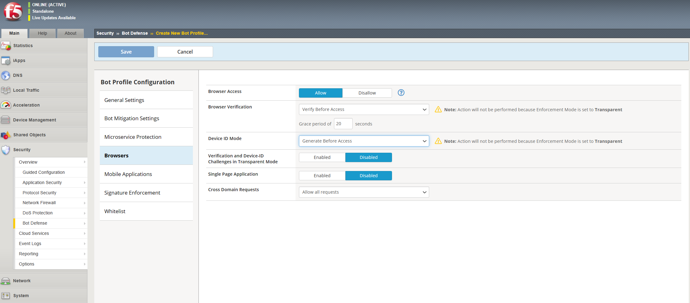
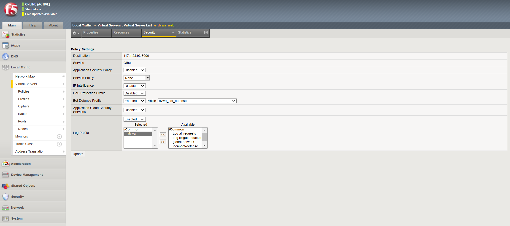

# THIẾT LẬP CƠ CHẾ CHỐNG DOS CHỦ ĐỘNG 

## Giới thiệu tổng quan

Chúng ta có thể bảo vệ các ứng dụng web của mình trước lưu lượng bot Internet bằng cách định cấu hình cấu hình DoS và bật các tính năng Kiểm tra Chữ ký Bot và Phòng thủ Chủ động cho Bot. Sau đó, chúng ta có thể liên kết trực tiếp cấu hình DoS với máy chủ ảo của mình. Khi cấu hình tính năng Proactive Bot Defense, hệ thống sẽ sử dụng JavaScript để đánh giá dấu hiệu của bot và xác định xem các trình duyệt truy cập trang web của bạn có hợp pháp hay không. Khi cấu hình tính năng Kiểm tra chữ ký của bot, hệ thống sẽ phân tích chuỗi user-agent trong HTTP Header để tìm tên miền của bot. Sau đó, hệ thống ASM thực hiện tra cứu DNS ngược trên tên miền và xác định các bot là hợp pháp hay độc hại.

## Hướng dẫn cấu hình

1. Trên Main tab, chọn `Security` > `Bot Defense` > `Bot Defense Profile`
2. Chọn `Create` để tạo bot profile và nhập bot profile
3. Chọn mục `Browser` để cấu hình proactive bot defense

Browser Access: Nhiều ứng dụng máy chủ dành riêng cho ứng dụng di động và không dành cho truy cập trình duyệt. Do đó, các trình duyệt truy cập các ứng dụng di động này thường do những kẻ tấn công điều khiển và nên bị chặn. Giá trị mặc định là cho phép(Allow).

Browser Verification: Chỉ định nội dung và thời điểm hệ thống gửi thử thách.
  + None: Hệ thống không thực hiện xác minh JavaScript và Header-based. Tuy nhiên, một số phát hiện bất thường (chẳng hạn như Session Opening) vẫn xảy ra.
  + Challenge-Free Verification: Giá trị mặc định khi **Profile Template** được đặt thành Relaxed. Hệ thống thực hiện xác minh Header-based nhưng không thực hiện xác minh JavaScript.
  + Verify Before Access: Giá trị mặc định khi **Profile Template** được đặt thành Strict. Hệ thống sẽ gửi một trang trắng có JavaScript để thử thách truy cập. Nếu máy khách không vượt qua thử thách, hệ thống sẽ thực hiện hành động phòng chống đã cấu hình và báo cáo sự bất thường. Nếu máy khách vượt qua thử thách, hệ thống sẽ chuyển tiếp yêu cầu đến máy chủ.
  + Verify After Access (Blocking): Giá trị mặc định khi **Profile Template** được đặt thành Balanced. Hệ thống đưa ra một thử thách JavaScript trong phản hồi của máy chủ trước khi gửi phản hồi cho máy khách. Nếu máy khách không vượt qua thử thách, hệ thống sẽ thực hiện hành động phòng chống đã cấu hình và báo cáo sự bất thường. Nếu khách hàng vượt qua thử thách, hệ thống sẽ chuyển tiếp yêu cầu đến máy chủ.
  + Verify After Access (Detection Only): Hệ thống đưa thử thách JavaScript vào phản hồi của máy chủ trước khi gửi phản hồi cho máy khách. Nếu máy khách không vượt qua thử thách, hệ thống chỉ báo cáo sự bất thường nhưng không thực hiện bất kỳ hành động phòng chống nào. Nếu khách hàng vượt qua thử thách, hệ thống sẽ chuyển tiếp yêu cầu đến máy chủ.

  
Device ID Mode: Mã định danh duy nhất mà BIG-IP ASM tạo bằng cách gửi JavaScript để lấy thông tin về thiết bị khách. Giá trị mặc định cho cài đặt này được xác định bởi lựa chọn của bạn trong **Profile Template** (trong General Settings). Chúng ta nên sử dụng các giá trị mặc định được đặt bởi **Profile Template** đã chọn trừ khi có các yêu cầu ứng dụng cụ thể.
  + None: Giá trị mặc định khi **Profile Template** được đặt thành Relaxed. Hệ thống không gửi JavaScript để thu thập ID thiết bị
  + Generate After Access: Giá trị mặc định khi **Profile Template** được đặt thành Balanced. Hệ thống đưa JavaScript vào phản hồi của máy chủ trước khi chuyển tiếp đến máy khách. Điều này ít xâm phạm hơn và ít ảnh hưởng đến độ trễ hơn.
  + Generate Before Access: Giá trị mặc định khi **Profile Template** được đặt thành Strict. Hệ thống gửi thử thách JavaScript tới máy khách trước khi chuyển tiếp yêu cầu của máy khách tới máy chủ. Điều này đảm bảo rằng mọi yêu cầu đến máy chủ đều có ID thiết bị. Điều này có nhiều tác động về độ trễ hơn so với tùy chọn trước đó. Hệ thống chặn các bot cố gắng thể hiện mình là trình duyệt nhưng không thể thực hiện thử thách JavaScript.

Verification and Device-ID Challenges in Transparent Mode: Mặc định là Tắt. Khi được bật, hệ thống sẽ gửi thử thách JavaScript và kiểm tra xác minh cho khách hàng, mặc dù Chế độ thực thi (trong General Settings) được đặt thành Transparent.

Single Page Application: Khi ứng dụng web tải nội dung mới mà không kích hoạt tải lại toàn bộ trang, nó được coi là Ứng dụng một trang (SPA). Khi được bật, hệ thống sẽ đưa các thử thách JavaScript vào mọi phản hồi, do đó gửi nhiều thử thách khác nhau (chẳng hạn như xác minh trình duyệt, ID thiết bị và CAPTCHA) mà không yêu cầu tải lại trang. Mặc định là Tắt.

Cross Domain Requests:
  + Allow all requests: Cho phép các yêu cầu đối với các tài nguyên không phải HTML sau khi chúng vượt qua thử thách cookie chuyển hướng của hệ thống. Đây là giá trị mặc định.
  + Allow configured domains; validate in bulk: Cho phép yêu cầu đối với các tài nguyên không phải HTML nếu miền trong tiêu đề người giới thiệu khớp với miền được định cấu hình trong cài đặt Miền trang web có liên quan hoặc Miền bên ngoài có liên quan. Hệ thống tìm nạp cookie từ các miền được định cấu hình trước trong cài đặt **Related Site Domains**. Đề xuất tùy chọn này nếu ứng dụng của bạn có nhiều tài nguyên tên miền chéo.
  + Allow configured domains; validate upon request: Cho phép yêu cầu đối với các tài nguyên không phải HTML nếu miền trong referer header khớp với miền được cấu hình trong cài đặt Related Site Domains hoặc Related External Domains. Hệ thống tìm nạp cookie từ các miền được cấu hình trong cài đặt **Related Site Domains** trong thời gian thực khi chúng được yêu cầu. Đề xuất tùy chọn này nếu ứng dụng của bạn không có nhiều tài nguyên tên miền chéo.

4. Chọn `Save` để lưu cấu hình

### Gán profile chống bot tới máy chủ ảo

1. Trên Main tab, chọn `Local Traffic` > `Virtual Server` > `Virtual Server List` và chọn máy chủ ảo để liên kết tới bot defense profile 
2. Chọn `Security` > `Policies`
3. Trong bảng Policy Settings, mục Bot Defense Profile, chọn `Enabled` và chọn bot defense profile từ menu
4. Chọn Log Profile từ cột Available chuyển sang cột Selected để thực hiện đẩy log 

5. Chọn `Update` để hoàn thành cấu hình

## Liên hệ hỗ trợ
Yêu cầu hỗ trợ kỹ thuật xin gửi đến địa chỉ: techsupport@viettelcloud.vn

