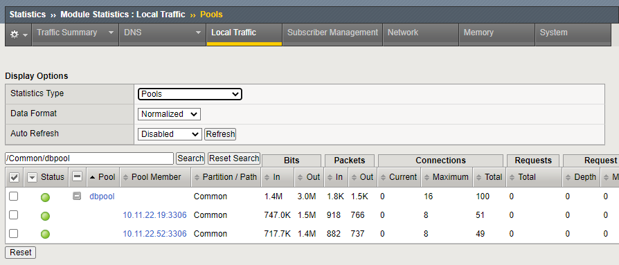
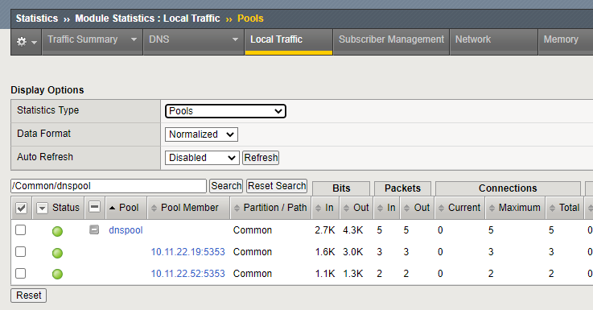
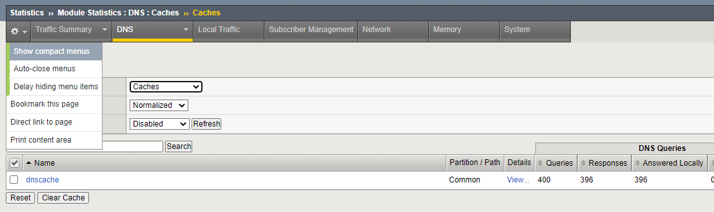

# Đây là hướng dẫn sử dụng dịch vụ cân bằng tải của F5 BIG-IP

## Hướng dẫn cấu hình dịch vụ

### Các giao thức hỗ trợ
#### 1. Cân bằng tải cho các giao thức TCP/UDP nói chung

Hệ thống F5 BIG-IP có khả năng thực hiện việc cân bằng tải lớp 4 (TCP/UDP), tài liệu này sẽ minh họa việc F5 BIG-IP thực hiện cân bằng tải cho hệ quản trị cơ sở dữ liệu MySQL (giao thức TCP, port 3306).

Về mô hình, ta sẽ có 3 thành phần:
- 2 hoặc nhiều máy chủ MySQL server, việc cấu hình đồng bộ dữ liệu giữa các máy chủ MySQL không thuộc phạm vi của tài liệu này. Trong ví dụ dưới đây, client cũng chỉ thực hiện đơn thuần việc chèn các bản ghi vào cơ sở dữ liệu
- Hệ thống F5 BIG-IP đóng vai trò là thiết bị cân bằng tải, nhận kết nối từ MySQL client và chia tải cho các máy chủ MySQL server
- Máy trạm MySQL client, thực hiện các lệnh SQL chèn dữ liệu

Trước khi cấu hình F5 BIG-IP, cần đảm bảo rằng các máy chủ MySQL được thiết lập trước, với cơ sở dữ liệu và cấu trúc các bảng được tạo sẵn (giống nhau trên tất cả các máy chủ MySQL). Để thử nghiệm tính năng, có thể dùng docker image của MySQL, khởi tạo bằng lệnh
```
sudo docker run --name mysql -e MYSQL_ROOT_PASSWORD=hyKx94KaKM2tQBQ9 -d -p 3306:3306 mysql
``` 
Sau đó tạo cơ sở dữ liệu và cấu trúc bảng để sau có thể chèn dữ liệu vào:
```
CREATE DATABASE theloadbalanceddb;
USE theloadbalanceddb;
CREATE TABLE mytable (
    msg_id int NOT NULL AUTO_INCREMENT,
    msg_text varchar(255),
    PRIMARY KEY (msg_id)
);
```
Trên F5 BIG-IP, truy cập vào bằng giao diện đồ họa hoặc dòng lệnh để thực hiện:
- Tạo node cho từng máy chủ MySQL server, ví dụ ở đây ta có 2 node có địa chỉ IP tương ứng là 10.11.22.19 và 10.11.22.52
- Tạo pool tên là dbpool, cơ chế monitor có thể chọn là TCP hoặc MySQL tùy theo nhu cầu. Pool này có các member là các node vừa tạo, port là 3306 (port mặc định của MySQL)
- Tạo virtual server tên là vs_dbloadbalance, với địa chỉ VIP được quản lý bở F5 BIG-IP, port 3306, default pool là dbpool, Source address translation đặt là Automap

Dưới đây là các lệnh (tmsh) để thực hiện các bước ở trên:
```
create ltm node 10.11.22.19
create ltm node 10.11.22.52
create ltm pool dbpool members add { 10.11.22.19:3306 10.11.22.52:3306 } monitor tcp
create ltm virtual vs_dbloadbalance destination 117.1.28.13:3306 ip-protocol tcp pool dbpool source-address-translation { type automap }

save sys config
```
Để kiểm tra khả năng cân bằng tải, trên máy trạm MySQL client, viết 1 script đơn giản như sau:
```
#!/bin/bash
for i in {1..100}
do
    data=`cat /proc/sys/kernel/random/uuid | sed 's/[-]//g' | head -c 20`
    mysql -h117.1.28.13 -uroot -phyKx94KaKM2tQBQ9 theloadbalanceddb << EOF
    INSERT INTO mytable (\`msg_text\`) VALUES ("random text is $data");
    EOF
done
```
Thực hiện script này và quan sát thống kê trên F5 BIG-IP (Pool statistics):



Như vậy, với cơ chế cân bằng tải Round-robin mặc định, ta thấy connection được chia tương đối đều cho 2 máy chủ (49 và 51). 

Để kiểm tra số lượng bản ghi được tạo trên từng máy chủ MySQL, ta có thể vào trong từng máy chủ, đếm số bản ghi được tạo ra bởi lệnh `select count(*) from mytable`

Trên node thứ nhất:
```
mysql> select count(*) from mytable;
+----------+
| count(*) |
+----------+
|       49 |
+----------+
1 row in set (0.04 sec)
```
Trên node thứ hai:
```
mysql> select count(*) from mytable;
+----------+
| count(*) |
+----------+
|       51 |
+----------+
1 row in set (0.03 sec)
```

Tương tự như vậy, F5 BIG-IP cũng hỗ trợ cân bằng tải cho giao thức UDP, sự khác biệt đối với trường hợp trên chỉ ở 2 bước:
- Cơ chế monitor pool, đối với UDP, nên sử dụng các cơ chế monitor lớp ứng dụng, ví dụ DNS thì gửi truy vấn tới một domain cụ thể. Trường hợp giao thức không có phản hồi tương tự như DNS, chẳng hạn syslog, ta có thể cần kiểm tra xem server có trả về `ICMP port unreachable` hay không, vì đây là căn cứ mà F5 BIG-IP sử dụng để đánh giá trạng thái của server với cơ chế monitor UDP. Nhìn chung, như vậy không phải là cách monitor tin cậy, cần dùng kết hợp với một cơ chế monitor khác nữa, tùy thuộc vào đặc tính của giao thức.

Nếu vẫn muốn chỉ sử dụng cơ chế monitor là udp, lệnh tạo pool như sau (ví dụ cho syslog trên port 514):
```
create ltm pool syslogpool members add { 10.11.22.19:514 10.11.22.52:514 } monitor udp
```

- Giao thức áp dụng khi tạo virtual server, cụ thể, với lệnh `create ltm virtual`, tham số `ip-protocol` cần đặt là `udp`. Ví dụ lệnh hoàn chỉnh như sau:
```
create ltm virtual vs_syslog_loadbalance destination 117.1.28.13:514 ip-protocol udp pool syslogpool source-address-translation { type automap }
```

#### 2. Cân bằng tải cho các giao thức DNS

Giao thức DNS hỗ trợ cả TCP và UDP (UDP thường được ưu tiên sử dụng), về nguyên tắc, có thể thực hiện cấu hình cân bằng tải cho DNS như đối với bất kỳ giao thức nào khác chỉ dựa trên TCP/UDP. Tuy nhiên đối với F5 BIG-IP, nếu có license DNS, hệ thống có thể thực hiện việc cache nhằm tăng tốc độ truy vấn. Dưới đây là một bài test cơ bản, cân bằng tải và cache cho DNS. Mô hình gồm có
- Hai hoặc nhiều máy chủ DNS
- F5 BIG-IP với license DNS để thực hiện cân bằng tải và cache các DNS response
- Máy trạm gửi các truy vấn DNS tới F5 BIG-IP

Trước hết, cần đảm bảo rằng F5 BIG-IP có license và đã bật module DNS (xem trong `System` > `License` và `System` > `Resource Provisioning`)

Để minh họa, có thể sử dụng docker image của **unbound** làm DNS recursive resolver. Trên các máy chủ DNS, chạy dịch vụ DNS trên port 5353 (để tránh xung đột với dịch vụ nào đó đang dùng port chuẩn 53, dù sao, client cũng không truy cập bằng port này trực tiếp). Ví dụ:
```
sudo docker run --name unbound -d -p 5353:53/udp -p 5353:53/tcp mvance/unbound
```

Trên F5 BIG-IP, thực hiện các bước sau (giao diện đồ họa hoặc dòng lệnh):
- Tạo các node là các dns server
- Tạo cơ chế monitor là dnsmonitor với việc định kỳ truy vấn đến `google.com` 
- Tạo pool tên là dnspool với các member là các node đã tạo, port dịch vụ là 5353, cơ chế monitor là dnsmonitor đã tạo
- Tạo cấu hình DNS cache đặt tên là dnscache
- Tạo cấu hình DNS profile có sử dụng cache dnscache và đặt tên là dnsprofile
- Tạo virtual server tên là vs_dnsloadbalance với địa chỉ VIP được sử dụng bởi F5 BIG-IP, port dịch vụ là 53, pool là dnspool, giao thức là tcp/udp, sử dụng DNS profile là dnsprofile, source address translation là Automap

Ví dụ dưới đây là các lệnh (tmsh) để cấu hình các bước ở trên:

```
create ltm node 10.11.22.19
create ltm node 10.11.22.52
create ltm monitor dns dnsmonitor qname google.com
create ltm pool dnspool members add { 10.11.22.19:5353 10.11.22.52:5353 } monitor dnsmonitor
create ltm dns cache transparent dnscache
create ltm profile dns dnsprofile enable-cache yes cache dnscache

create ltm virtual vs_dnsloadbalance_udp destination 117.1.28.13:53 ip-protocol udp pool dnspool profiles add { dnsprofile } source-address-translation { type automap }
create ltm virtual vs_dnsloadbalance_tcp destination 117.1.28.13:53 ip-protocol tcp pool dnspool profiles add { dnsprofile } source-address-translation { type automap }

save sys config
```

Để kiểm tra khả năng cân bằng tải, trên máy trạm DNS client, viết 1 script đơn giản như sau:
```
#!/bin/bash

for i in {1..100}
do
 dig @117.1.28.13 youtube.com
 dig @117.1.28.13 google.com
 dig @117.1.28.13 dantri.com.vn
 dig @117.1.28.13 vnexpress.net
done

```
Thực hiện script này và quan sát thống kê trên F5 BIG-IP (Pool statistics):



Ta có thể thấy ngay, mặc dù vòng lặp ở script test chạy 100 lần, mỗi lần gửi 4 query nhưng số connection thực sự gửi tới các máy chủ DNS chỉ có tổng cộng là 5 (3+2)

Để xem chính xác số query được client gửi tới F5 BIG-IP, truy cập vào giao diện quản trị web, xem thống kê của DNS cache tại `DNS` > `Caches` > `Statistics`:



Ta có thể thấy có 400 query gửi tới, nhưng hệ thống F5 BIG-IP đã trả lời 396 response bằng cách sử dụng cache của 4 response đầu tiên từ server.

#### 3. Cân bằng tải cho các giao thức SSH

Giao thức SSH hoạt động dựa trên giao thức TCP, về nguyên tắc, có thể thực hiện cấu hình cân bằng tải cho SSH như đối với bất kỳ giao thức nào khác chỉ dựa trên TCP (layer 4 thuần túy).

Ví dụ dưới đây là các lệnh (tmsh) để tạo node, tạo pool và virtual server cho việc cân bằng tải SSH Servers:
```
create ltm node 10.11.22.19
create ltm node 10.11.22.52
create ltm pool sshpool members add { 10.11.22.19:22 10.11.22.52:22 } monitor tcp
create ltm virtual vs_sshloadbalance destination 117.1.28.13:2222 ip-protocol tcp pool sshpool source-address-translation { type automap }
```

Từ máy trạm client, có thể truy cập đến SSH thông qua F5 BIG-IP bằng lệnh:
```
ssh -o StrictHostKeyChecking=no -o UserKnownHostsFile=/dev/null -p 2222 bien@117.1.28.13
```
> Lưu ý: 
-User phải tồn tại trên tất cả các máy chủ SSH
-Client phải cho phép không kiểm tra host key và cũng không lưu lại thông tin này


#### 4. Cân bằng tải từ HTTP vào HTTP
#### 5. Cân bằng tải từ HTTPS vào HTTP
#### 6. Cân bằng tải từ HTTPS vào HTTPS
