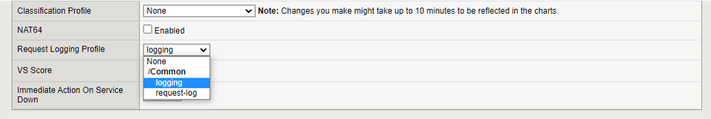
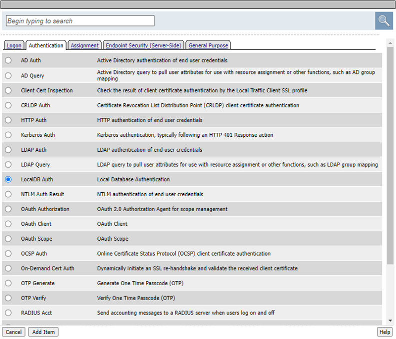
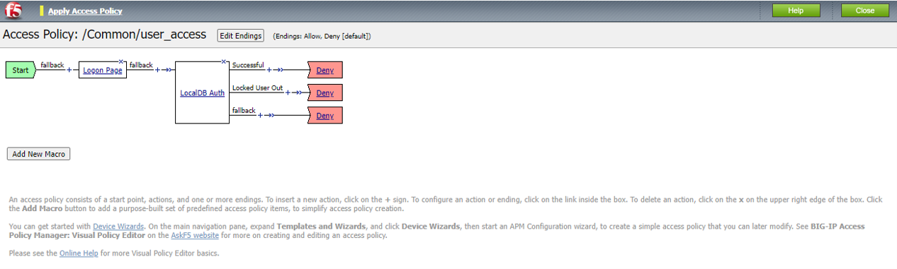

# I. CÁC GIAO THỨC CÂN BẰNG TẢI HỖ TRỢ
## Giới thiệu tổng quan
Các giao thức cân bằng tải được cung cấp bởi BIG-IP bao gồm:
- Các giao thức TCP/UDP nói chung
- Các giao thức DNS
- Các giao thức SSH
- Cân bằng tải từ HTTP vào HTTP
- Cân bằng tải từ HTTPS vào HTTP
- Cân bằng tải từ HTTPS vào HTTPS

## Hướng dẫn cấu hình dịch vụ
### 1. Cân bằng tải cho các giao thức TCP/UDP nói chung

Hệ thống F5 BIG-IP có khả năng thực hiện việc cân bằng tải lớp 4 (TCP/UDP), tài liệu này sẽ minh họa việc F5 BIG-IP thực hiện cân bằng tải cho hệ quản trị cơ sở dữ liệu MySQL (giao thức TCP, port 3306).

Về mô hình, ta sẽ có 3 thành phần:
- 2 hoặc nhiều máy chủ MySQL server, việc cấu hình đồng bộ dữ liệu giữa các máy chủ MySQL không thuộc phạm vi của tài liệu này. Trong ví dụ dưới đây, client cũng chỉ thực hiện đơn thuần việc chèn các bản ghi vào cơ sở dữ liệu
- Hệ thống F5 BIG-IP đóng vai trò là thiết bị cân bằng tải, nhận kết nối từ MySQL client và chia tải cho các máy chủ MySQL server
- Máy trạm MySQL client, thực hiện các lệnh SQL chèn dữ liệu

Trước khi cấu hình F5 BIG-IP, cần đảm bảo rằng các máy chủ MySQL được thiết lập trước, với cơ sở dữ liệu và cấu trúc các bảng được tạo sẵn (giống nhau trên tất cả các máy chủ MySQL). Để thử nghiệm tính năng, có thể dùng docker image của MySQL, khởi tạo bằng lệnh
```
sudo docker run --name mysql -e MYSQL_ROOT_PASSWORD=hyKx94KaKM2tQBQ9 -d -p 3306:3306 mysql
``` 
Sau đó tạo cơ sở dữ liệu và cấu trúc bảng để sau có thể chèn dữ liệu vào:
```
CREATE DATABASE theloadbalanceddb;
USE theloadbalanceddb;
CREATE TABLE mytable (
    msg_id int NOT NULL AUTO_INCREMENT,
    msg_text varchar(255),
    PRIMARY KEY (msg_id)
);
```
Trên F5 BIG-IP, truy cập vào bằng giao diện đồ họa hoặc dòng lệnh để thực hiện:
- Tạo node cho từng máy chủ MySQL server, ví dụ ở đây ta có 2 node có địa chỉ IP tương ứng là 10.11.22.19 và 10.11.22.52
- Tạo pool tên là dbpool, cơ chế monitor có thể chọn là TCP hoặc MySQL tùy theo nhu cầu. Pool này có các member là các node vừa tạo, port là 3306 (port mặc định của MySQL)
- Tạo virtual server tên là vs_dbloadbalance, với địa chỉ VIP được quản lý bở F5 BIG-IP, port 3306, default pool là dbpool, Source address translation đặt là Automap

Dưới đây là các lệnh (tmsh) để thực hiện các bước ở trên:
```
create ltm node 10.11.22.19
create ltm node 10.11.22.52
create ltm pool dbpool members add { 10.11.22.19:3306 10.11.22.52:3306 } monitor tcp
create ltm virtual vs_dbloadbalance destination 117.1.28.13:3306 ip-protocol tcp pool dbpool source-address-translation { type automap }

save sys config
```
Để kiểm tra khả năng cân bằng tải, trên máy trạm MySQL client, viết 1 script đơn giản như sau:
```
#!/bin/bash
for i in {1..100}
do
    data=`cat /proc/sys/kernel/random/uuid | sed 's/[-]//g' | head -c 20`
    mysql -h117.1.28.13 -uroot -phyKx94KaKM2tQBQ9 theloadbalanceddb << EOF
    INSERT INTO mytable (\`msg_text\`) VALUES ("random text is $data");
    EOF
done
```
Thực hiện script này và quan sát thống kê trên F5 BIG-IP (Pool statistics):


Như vậy, với cơ chế cân bằng tải Round-robin mặc định, ta thấy connection được chia tương đối đều cho 2 máy chủ (49 và 51). 

Để kiểm tra số lượng bản ghi được tạo trên từng máy chủ MySQL, ta có thể vào trong từng máy chủ, đếm số bản ghi được tạo ra bởi lệnh `select count(*) from mytable`

Trên node thứ nhất:
```
mysql> select count(*) from mytable;
+----------+
| count(*) |
+----------+
|       49 |
+----------+
1 row in set (0.04 sec)
```
Trên node thứ hai:
```
mysql> select count(*) from mytable;
+----------+
| count(*) |
+----------+
|       51 |
+----------+
1 row in set (0.03 sec)
```

Tương tự như vậy, F5 BIG-IP cũng hỗ trợ cân bằng tải cho giao thức UDP, sự khác biệt đối với trường hợp trên chỉ ở 2 bước:
- Cơ chế monitor pool, đối với UDP, nên sử dụng các cơ chế monitor lớp ứng dụng, ví dụ DNS thì gửi truy vấn tới một domain cụ thể. Trường hợp giao thức không có phản hồi tương tự như DNS, chẳng hạn syslog, ta có thể cần kiểm tra xem server có trả về `ICMP port unreachable` hay không, vì đây là căn cứ mà F5 BIG-IP sử dụng để đánh giá trạng thái của server với cơ chế monitor UDP. Nhìn chung, như vậy không phải là cách monitor tin cậy, cần dùng kết hợp với một cơ chế monitor khác nữa, tùy thuộc vào đặc tính của giao thức.

Nếu vẫn muốn chỉ sử dụng cơ chế monitor là udp, lệnh tạo pool như sau (ví dụ cho syslog trên port 514):
```
create ltm pool syslogpool members add { 10.11.22.19:514 10.11.22.52:514 } monitor udp
```

- Giao thức áp dụng khi tạo virtual server, cụ thể, với lệnh `create ltm virtual`, tham số `ip-protocol` cần đặt là `udp`. Ví dụ lệnh hoàn chỉnh như sau:
```
create ltm virtual vs_syslog_loadbalance destination 117.1.28.13:514 ip-protocol udp pool syslogpool source-address-translation { type automap }
```

### 2. Cân bằng tải cho các giao thức DNS

Giao thức DNS hỗ trợ cả TCP và UDP (UDP thường được ưu tiên sử dụng), về nguyên tắc, có thể thực hiện cấu hình cân bằng tải cho DNS như đối với bất kỳ giao thức nào khác chỉ dựa trên TCP/UDP. Tuy nhiên đối với F5 BIG-IP, nếu có license DNS, hệ thống có thể thực hiện việc cache nhằm tăng tốc độ truy vấn. Dưới đây là một bài test cơ bản, cân bằng tải và cache cho DNS. Mô hình gồm có
- Hai hoặc nhiều máy chủ DNS
- F5 BIG-IP với license DNS để thực hiện cân bằng tải và cache các DNS response
- Máy trạm gửi các truy vấn DNS tới F5 BIG-IP

Trước hết, cần đảm bảo rằng F5 BIG-IP có license và đã bật module DNS (xem trong `System` > `License` và `System` > `Resource Provisioning`)

Để minh họa, có thể sử dụng docker image của **unbound** làm DNS recursive resolver. Trên các máy chủ DNS, chạy dịch vụ DNS trên port 5353 (để tránh xung đột với dịch vụ nào đó đang dùng port chuẩn 53, dù sao, client cũng không truy cập bằng port này trực tiếp). Ví dụ:
```
sudo docker run --name unbound -d -p 5353:53/udp -p 5353:53/tcp mvance/unbound
```

Trên F5 BIG-IP, thực hiện các bước sau (giao diện đồ họa hoặc dòng lệnh):
- Tạo các node là các dns server
- Tạo cơ chế monitor là dnsmonitor với việc định kỳ truy vấn đến `google.com` 
- Tạo pool tên là dnspool với các member là các node đã tạo, port dịch vụ là 5353, cơ chế monitor là dnsmonitor đã tạo
- Tạo cấu hình DNS cache đặt tên là dnscache
- Tạo cấu hình DNS profile có sử dụng cache dnscache và đặt tên là dnsprofile
- Tạo virtual server tên là vs_dnsloadbalance với địa chỉ VIP được sử dụng bởi F5 BIG-IP, port dịch vụ là 53, pool là dnspool, giao thức là tcp/udp, sử dụng DNS profile là dnsprofile, source address translation là Automap

Ví dụ dưới đây là các lệnh (tmsh) để cấu hình các bước ở trên:

```
create ltm node 10.11.22.19
create ltm node 10.11.22.52
create ltm monitor dns dnsmonitor qname google.com
create ltm pool dnspool members add { 10.11.22.19:5353 10.11.22.52:5353 } monitor dnsmonitor
create ltm dns cache transparent dnscache
create ltm profile dns dnsprofile enable-cache yes cache dnscache

create ltm virtual vs_dnsloadbalance_udp destination 117.1.28.13:53 ip-protocol udp pool dnspool profiles add { dnsprofile } source-address-translation { type automap }
create ltm virtual vs_dnsloadbalance_tcp destination 117.1.28.13:53 ip-protocol tcp pool dnspool profiles add { dnsprofile } source-address-translation { type automap }

save sys config
```

Để kiểm tra khả năng cân bằng tải, trên máy trạm DNS client, viết 1 script đơn giản như sau:
```
#!/bin/bash

for i in {1..100}
do
 dig @117.1.28.13 youtube.com
 dig @117.1.28.13 google.com
 dig @117.1.28.13 dantri.com.vn
 dig @117.1.28.13 vnexpress.net
done

```
Thực hiện script này và quan sát thống kê trên F5 BIG-IP (Pool statistics):


Ta có thể thấy ngay, mặc dù vòng lặp ở script test chạy 100 lần, mỗi lần gửi 4 query nhưng số connection thực sự gửi tới các máy chủ DNS chỉ có tổng cộng là 5 (3+2)

Để xem chính xác số query được client gửi tới F5 BIG-IP, truy cập vào giao diện quản trị web, xem thống kê của DNS cache tại `DNS` > `Caches` > `Statistics`:


Ta có thể thấy có 400 query gửi tới, nhưng hệ thống F5 BIG-IP đã trả lời 396 response bằng cách sử dụng cache của 4 response đầu tiên từ server.

### 3. Cân bằng tải cho các giao thức SSH

Giao thức SSH hoạt động dựa trên giao thức TCP, về nguyên tắc, có thể thực hiện cấu hình cân bằng tải cho SSH như đối với bất kỳ giao thức nào khác chỉ dựa trên TCP (layer 4 thuần túy).

Ví dụ dưới đây là các lệnh (tmsh) để tạo node, tạo pool và virtual server cho việc cân bằng tải SSH Servers:
```
create ltm node 10.11.22.19
create ltm node 10.11.22.52
create ltm pool sshpool members add { 10.11.22.19:22 10.11.22.52:22 } monitor tcp
create ltm virtual vs_sshloadbalance destination 117.1.28.13:2222 ip-protocol tcp pool sshpool source-address-translation { type automap }

save sys config
```

Từ máy trạm client, có thể truy cập đến SSH thông qua F5 BIG-IP bằng lệnh:
```
ssh -o StrictHostKeyChecking=no -o UserKnownHostsFile=/dev/null -p 2222 bien@117.1.28.13
```
> Lưu ý: 
-User phải tồn tại trên tất cả các máy chủ SSH
-Client phải cho phép không kiểm tra host key và cũng không lưu lại thông tin này

### 4. Cân bằng tải từ HTTP vào HTTP

Hiện nay, hầu hết các website đều chạy HTTPS, tuy nhiên nếu cần, hệ thống F5 BIG-IP cũng có thể thực hiện cân bằng tải cho giao thức HTTP như bình thường.

Với mô hình này:
- Client hết nối qua giao thức HTTP với F5 BIG-IP
- F5 BIG-IP kết nối/chia tải tới các máy chủ dịch vụ cũng qua giao thức HTTP

Ví dụ dưới đây là các lệnh (tmsh) để tạo node, tạo pool và virtual server cho việc cân bằng tải giao thức HTTP:
```
create ltm node 10.11.22.19
create ltm node 10.11.22.52
create ltm pool http_pool members add { 10.11.22.19:8080 10.11.22.52:8080 } monitor http
create ltm virtual vs_httploadbalance destination 117.1.28.13:80 ip-protocol tcp pool http_pool profiles add { http } source-address-translation { type automap }

save sys config
```
Để test, trên 2 máy chủ web có thể chạy một instance của nginx bằng docker, đơn giản với lệnh như sau:
```
sudo docker run -d --name nginx -p 8080:80 nginx
```

Quan sát trên giao diện quản trị F5 BIG-IP, phần `Local Traffic` > `Pools` > `Pool List` > `http_pool` có báo sẵn sàng không (UP, thể hiện bởi hình tròn mầu xanh lá) trước khi thử truy cập qua địa chỉ VIP của F5 BIG-IP.

### 5. Cân bằng tải từ HTTPS vào HTTP

Đây là tình huống cũng thường được sử dụng, theo đó:
- Client hết nối qua giao thức HTTPS với F5 BIG-IP
- F5 BIG-IP kết nối/chia tải tới các máy chủ dịch vụ qua giao thức HTTP

Để làm được điều này, trên F5 BIG-IP cần có certificate và private key của domain tương ứng, đồng thời cấu hình SSL client profile.

Để import certificate vào F5 BIG-IP, trên giao diện quản trị web của F5 BIG-IP, truy cập vào menu:

`System` > `Certificate Management` > `Traffic Certificate Management` > `SSL Certificate List` > `Import`

Tại màn hình `SSL Certificate/Key Source`:
- Import Type: chọn **Certificate** nếu import certificate, chọn **Key** nếu import private key
- Key Name: nhập vào tên key. Có thể đặt tên key và cert trùng nhau (khuyến nghị)
- Key Source: chọn upload từ file hoặc paste vào nội dung file
- Security Type: chọn Password nếu private key được bảo vệ bằng mật khẩu, chọn **Normal** nếu không.

Để cấu hình SSL client profile, trên giao diện quản trị web của F5 BIG-IP, vào menu: `Local Traffic` > `Profiles` > `SSL` > `Client`, sau đó bấm vào nút `Create`

Tại màn hình tiếp theo:
- Name: đặt tên cho profile (để bước sau apply vào Virtual Server), ví dụ **dvwa_clientssl**
- Phần **Configuration**, mục **Certificate Key Chain**, bấm vào check box ngoài cùng bên phải để nút `Add` hiện ra. Bấm vào nút `Add`. Sau đó chọn certificate và key đã Import trước đó. Nhập vào **Passphrase** nếu private key được bảo vệ bởi mật khẩu khi Import.
Bấm nút `Add` để hoàn tất.

Ở màn hình ngoài, kéo xuống dưới và bấm vào nút `Finish` để hoàn tất.

Ví dụ dưới đây là các lệnh (tmsh) để tạo node, tạo pool và virtual server cho việc cân bằng tải giao thức HTTPS tới HTTP:
```
create ltm node 10.11.22.19
create ltm node 10.11.22.52
create ltm pool http_pool members add { 10.11.22.19:8080 10.11.22.52:8080 } monitor http
create ltm virtual vs_https_to_http destination 117.1.28.13:443 ip-protocol tcp pool http_pool profiles add { http dvwa_clientssl } source-address-translation { type automap }

save sys config
```
> Lưu ý ở câu lệnh tạo virtual server bên trên, **dvwa_clientssl** chính là SSL client profile đã tạo trước đó.

Để test, trên 2 máy chủ web có thể chạy một instance của nginx bằng docker, đơn giản với lệnh như sau:
```
sudo docker run -d --name nginx -p 8080:80 nginx
```
Quan sát trên giao diện quản trị F5 BIG-IP, phần `Local Traffic` > `Pools` > `Pool List` > `http_pool` có báo sẵn sàng không (UP, thể hiện bởi hình tròn mầu xanh lá) trước khi thử truy cập qua địa chỉ VIP của F5 BIG-IP.

### 6. Cân bằng tải từ HTTPS vào HTTPS

Đây là tình huống người quản trị muốn mã hóa mọi lưu lượng vào/ra bất kể từ hướng nào, theo đó:
- Client hết nối qua giao thức HTTPS với F5 BIG-IP
- F5 BIG-IP kết nối/chia tải tới các máy chủ dịch vụ cũng qua giao thức HTTPS

Để làm được điều này, trên F5 BIG-IP cần có certificate và private key của domain tương ứng, đồng thời cấu hình SSL client profile. Tham khảo mục trên để biết cách thức import certificate, private key và tạo SSL client profile

Ngoài ra, khi tạo pool, cũng cần áp dụng cơ chế monitor https và khi tạo virtual server, cũng cần apply SSL server profile.

Ví dụ dưới đây là các lệnh (tmsh) để tạo node, tạo pool và virtual server cho việc cân bằng tải giao thức HTTPS tới HTTP:
```
create ltm node 10.11.22.19
create ltm node 10.11.22.52
create ltm pool https_pool members add { 10.11.22.19:8443 10.11.22.52:8443 } monitor https
create ltm virtual vs_https_to_https destination 117.1.28.13:443 ip-protocol tcp pool https_pool profiles add { http dvwa_clientssl serverssl } source-address-translation { type automap }

save sys config
```

> Lưu ý ở câu lệnh tạo virtual server bên trên, **dvwa_clientssl** chính là SSL client profile đã tạo trước đó, **serverssl** là các thiết lập về SSL để F5 BIG-IP kết nối với máy chủ HTTPS phía sau.

Để test, trên 2 máy chủ web có thể chạy một instance của nginx bằng docker, đơn giản với lệnh như sau:
```
sudo docker run -d --name nginx -p 8080:80 -p 8443:443 nginx
```
Quan sát trên giao diện quản trị F5 BIG-IP, phần `Local Traffic` > `Pools` > `Pool List` > `https_pool` có báo sẵn sàng không (UP, thể hiện bởi hình tròn mầu xanh lá) trước khi thử truy cập qua địa chỉ VIP của F5 BIG-IP.

# II. CÁC PHƯƠNG THỨC CÂN BẰNG TẢI

## Giới thiệu tổng quan

Để đạt được tối ưu hiệu quả, việc lựa chọn phương thức cân bằng tải phù hợp lựa chọn vào nhiều yếu tố như ứng dụng cần chạy, khả năng xử lý của từng máy chủ hay hệ thống mạng của chúng.

Có 4 phương thức cân bằng tải phổ biến, theo mặc định, BIG-IP sẽ sử dụng phương thức **Round Robin**.

- **Round Robin:** Hệ thống lần lượt chuyển từng request đến từng máy chủ theo hàng nhằm đảm bảo phân phối request đồng đều cho tất cả các máy trong dãy máy được cân bằng tải
_<br>Round Robin thường được sử dụng khi các thiết bị cần cân bằng tải có có khả năng xử lý tương đương nhau._

- **Ratio:** Số lượng request cho mỗi máy theo thời gian phân phối theo tính theo tỷ lệ được cấu hình trước cho từng máy.
_<br>Ratio thường được sử dụng khi khả năng xử lý của các máy chủ trong nhóm khác nhau và bạn muốn chỉ định trọng số tỷ lệ thuận với tài nguyên và khả năng của từng máy._

- **Least Connections:** Thuật toán cân bằng tải động phân phối request tới máy chủ hiện đang duy trì ít connection nhất
_<br>Least Connections thường được sử dụng khi các thiết bị cần cân bằng tải có khả năng xử lý tương đương nhau._

- **Fastest:** Thuật toán cân bằng tải động hoạt động theo cơ chế đếm số lượng request chưa được xử lý (chưa có phản hồi) và phân phối tới máy chủ hiện còn ít số lượng request chưa xử lý nhất - máy chủ có khả năng xử lý nhanh nhất.
_<br>Fastest được sử dụng nhằm tối ưu thời gian nhận được phản hồi cho người dùng, đặc biệt hữu ích khi các máy cần cân bằng tải được đặt tại các mạng logic khác nhau._

## Hướng dẫn cấu hình


### 1. Cấu hình phương thức Round Robin

1. Đăng nhập vào giao diện cấu hình
2. Lựa chọn `Local Traffic` > `Pools` > `Pool lists`
3. Chọn pool cần cấu hình trong danh sách pool
4. Lựa chọn tab `Members`
5. Tại mục **Load Balancing Method** lựa chọn phương thức `Round Robin`


6. Bấm `Update` 

### 2. Cấu hình phương thức Ratio

1. Đăng nhập vào giao diện cấu hình
2. Lựa chọn `Local Traffic` > `Pools` > `Pool lists`
3. Chọn pool cần cấu hình trong danh sách pool
4. Lựa chọn tab `Members`
5. Tại mục **Load Balancing Method** lựa chọn phương thức `Ratio (member)`


6. Bấm `Update` 
7. Cấu hình ratio cho từng members
  
  7.1. Chọn member cần cấu hình trong danh sách member


  7.2. Điền thông số vào mục **Ratio**


  7.3. Bấm `Update` 


Như vậy sẽ có tỉ lệ phân phối kết nối tương ứng giữa `server_1` trên `server_2` là **1/5**_


### 3. Cấu hình phương thức Least Connections

1. Đăng nhập vào giao diện cấu hình
2. Lựa chọn `Local Traffic` > `Pools` > `Pool lists`
3. Chọn pool cần cấu hình trong danh sách pool
4. Lựa chọn tab `Members`
5. Tại mục **Load Balancing Method** lựa chọn phương thức `Least Connections (member)`


6. Bấm `Update` 


### 4. Cấu hình phương thức Fastest

1. Đăng nhập vào giao diện cấu hình
2. Lựa chọn `Local Traffic` > `Pools` > `Pool lists`
3. Chọn pool cần cấu hình trong danh sách pool
4. Lựa chọn tab `Members`
5. Tại mục **Load Balancing Method** lựa chọn phương thức `Fastest (application)`


6. Bấm `Update` 

### 5. Kiểm tra kết quả cân bằng tải:
1. Đăng nhập vào giao diện cấu hình
2. Lựa chọn `Local Traffic` > `Pools` > `Pool lists`
3. Chọn pool cần kiểm tra kết quả cân bằng tải trong danh sách pool
4. Lựa chọn tab `Statistics`


# III. CÁC CƠ CHẾ GIÁM SÁT MÁY CHỦ
## Giới thiệu tổng quan
Việc thiết lập giám sát giúp theo dõi tình trạng mới nhất của các máy chủ trong hệ thống cân bằng tải.

Các cơ chế giám sát phổ biến bao gồm: 
- **ICMP** (chủ động)
: Thực hiện ping địa chỉ IP để kiểm tra trạng thái
- **TCP** (chủ động)
: Gửi một yêu cầu kết nối TCP đến máy chủ và chờ đợi phản hồi để kiểm tra trạng thái
- **HTTP** (chủ động)
: Gửi request HTTP và chờ đợi phản hồi từ máy chủ web để kiểm tra trạng thái
- **DNS** (chủ động): Xác định trạng thái qua kết quả trạng thái phân giải từ việc gửi yêu cầu DNS về một tên miền 
- **Inband** (bị động): Cơ chế ghi nhận trạng thái thông qua hiệu suất làm việc của máy chủ 


## Hướng dẫn cấu hình
### 1. Cơ chế ICMP

1. Đăng nhập vào giao diện cấu hình
2. Lựa chọn `Local Traffic` > `Nodes` > `Node List`
3. Chọn node cần cấu hình trong danh sách node
4. Mặc định hiển thị tab `Properties`, tại mục **Select Monitors**, chọn `icmp` thuộc danh sách **Available**


   5. Chọn `<<`


   6. Chọn `Update`

### 2. Cơ chế TCP

1. Đăng nhập vào giao diện cấu hình
2. Lựa chọn `Local Traffic` > `Pools` > `Pool List`
3. Chọn pool cần cấu hình trong danh sách pool
4. Mặc định hiển thị tab `Properties`, tại mục **Health Monitors**, chọn `tcp` thuộc danh sách **Available**


   5. Chọn `<<`


   6. Chọn `Update`

### 3. Cơ chế HTTP

***Để tạo cơ chế giám sát theo tùy chỉnh:***
1. Đăng nhập vào giao diện cấu hình
2. Lựa chọn `Local Traffic` > `Monitors`
3. Mặc định hiển thị tab **Monitor List**, bấm `Create…`
4. Điền thông tin khởi tạo:
- Tại mục **Name**, nhập tên cơ chế
- Tại mục **Type**, lựa chọn giao thức `HTTP`


5. Thay đổi một số thông tin cấu hình tùy chỉnh theo nhu cầu sử dụng:
- Tại mục **Interval** _(mặc định là 5 giây)_, chỉnh sửa thông số để cấu hình tần suất tiến hành kiểm tra trạng thái theo số giây
- Tại mục **Timeout** _(mặc định là 5 giây)_, chỉnh sửa thông số để xác định thời gian tối đa chờ phản hồi, nếu ngoài thời gian ghi nhận trạng thái không hoạt động
- Tại mục **Send String** _(mặc định là GET /\r\n)_, chỉ định đối tượng đích đến bằng đường dẫn xuất, luôn cần bao gồm \r\n ở cuối. Ví dụ: `GET /login.php\r\n`


      
6. Chọn `Finished`

***Để cấu hình lựa chọn cơ chế giám sát:***
1. Đăng nhập vào giao diện cấu hình
2. Lựa chọn `Local Traffic` > `Pools` > `Pool List`
3. Chọn pool cần cấu hình trong danh sách pool
4. Mặc định hiển thị tab `Properties`, tại mục **Health Monitors**, chọn monitor **http** đã tạo tùy chỉnh hoặc `http` theo mặc định thuộc danh sách **Available**


   5. Chọn `<<`


   6. Chọn `Update`

### 4. Cơ chế DNS

***Để tạo cơ chế giám sát bằng DNS:***
1. Đăng nhập vào giao diện cấu hình
2. Lựa chọn `Local Traffic` > `Monitors`
3. Mặc định hiển thị tab **Monitor List**, bấm `Create…`
4. Điền thông tin khởi tạo:
- Tại mục **Name**, nhập tên cơ chế
- Tại mục **Type**, lựa chọn giao thức `DNS`


5. Thay đổi một số thông tin cấu hình tùy chỉnh theo nhu cầu sử dụng:
- Tại mục **Interval** _(mặc định là 5 giây)_, chỉnh sửa thông số để cấu hình tần suất tiến hành kiểm tra trạng thái theo số giây
- Tại mục **Timeout** _(mặc định là 16 giây)_, chỉnh sửa thông số để xác định thời gian tối đa chờ phản hồi, nếu ngoài thời gian ghi nhận trạng thái không hoạt động
- Tại mục **Query Name** _(bắt buộc phải điền)_, điền domain cần truy vấn để kiểm tra trạng thái phân giải. Ví dụ: `viettelcloud.vn` 
- Tại mục **Query Type** _(mặc định là **a**)_, điền kiểu truy vấn `a` nếu phân giải ra IPv4, `aaaa` nếu phân giải ra IPv6


6. Chọn `Finished`

***Để cấu hình lựa chọn cơ chế giám sát:***
1. Đăng nhập vào giao diện cấu hình
2. Lựa chọn `Local Traffic` > `Pools` > `Pool List`
3. Chọn pool cần cấu hình trong danh sách pool
4. Mặc định hiển thị tab `Properties`, tại mục **Health Monitors**, chọn monitor **dns** đã tạo thuộc danh sách **Available**


   5. Chọn `<<`


   6. Chọn `Update`

### 5. Cơ chế Inband

1. Đăng nhập vào giao diện cấu hình
2. Lựa chọn `Local Traffic` > `Pools` > `Pool List`
3. Chọn pool cần cấu hình trong danh sách pool
4. Mặc định hiển thị tab `Properties`, tại mục **Health Monitors**, chọn `inband` thuộc danh sách **Available**


   5. Chọn `<<`


   6. Chọn `Update`

# IV. MỘT SỐ TÍNH NĂNG RIÊNG CHO GIAO THỨC HTTP
## Giới thiệu tổng quan

BIG-IP cung cấp nhiều tính năng riêng cho giao thức HTTP, bao gồm:
- Tái sử dụng connection nhằm tận dụng connection layer 4 duy trì cho nhiều request
- Chèn thêm hoặc xóa header theo header value đã biết
- Loại bỏ header field của HTTP response theo điều kiện
- Request routing, request redirection để điều hướng truy cập
- Ghi lại log HTTP request
- Xác thực user truy cập - authentication

## Hướng dẫn cấu hình
### 1. Tái sử dụng connection
***Để tạo cơ chế tái sử dụng connection:***
1. Đăng nhập vào giao diện cấu hình
2. Lựa chọn `Local Traffic` > `Profiles` > `Other` > `OneConnect`
3. Chọn `Create…`


4. Điền tên **OneConnect Profile** tại mục **Name**


5. Tick chọn vào checkbox để thay đổi một số thông tin cấu hình tùy chỉnh theo nhu cầu sử dụng:
- Tại mục **Source Prefix Length** _(mặc định là **None**)_, chọn Sepcific > lựa chọn IPv4 hoặc IPv6 > nhập độ dài của tiền tố trong khoảng từ từ 0 đến 32 đối với IPv4 hoặc từ 0 đến 128 đối với IPv6
<br>_* Source Prefix Length được sử dụng xác định độ dài tiền tố của địa chỉ IP trong kết nối TCP nhằm phục vụ việc tái sử dụng. Ví dụ, đối với IPv4, giá trị bằng 0 cho phép chia sẻ kết nối trên tất cả các địa chỉ nguồn, giá trị 32 chỉ cho phép chia sẻ kết nối với chỉ một địa chỉ nguồn_
- Tại mục **Maximum Size** _(mặc định là 10000 connect)_, chỉnh sửa thông số về số lượng kết nối được duy trì tối đa
- Tại mục  **Maximum Size** _(mặc định là 86400 giây ~ 1 ngày)_, chỉnh sửa thông số về thời gian kết nối tối đa cho một kết nối được tái sử dụng
- Tại mục **Maximum Reuse**_(mặc định là 1000)_, chỉnh sửa thông số về số lần tái sử dụng tối đa cho một kết nối


6. Chọn `Finished`

***Để cấu hình sử dụng **OneConnect Profile** đã tạo:***
1. Đăng nhập vào giao diện cấu hình
2. Lựa chọn `Local Traffic` > `Virtual Servers` > `Virtual Servers Lists`


3. Chọn virtual server trong danh sách virtual server
4. Tại mục **OneConnect Profile**, chọn cơ chế **OneConnect Profile** tùy chỉnh đã tạo hoặc sử dụng cơ chế `oneconnect` mặc định có trong danh sách


5. Chọn `Update`

### 2. Chèn, xóa header theo header value đã biết
***Để tạo cơ chế chèn hay xóa header:***
1. Đăng nhập vào giao diện cấu hình
2. Lựa chọn `Local Traffic` > `Profiles` > `Services` > `HTTP`

3. Chọn `Create…`


4. Điền tên **HTTP Profile** tại mục **Name**


5. Tick chọn vào checkbox để thay đổi một số thông tin cấu hình tùy chỉnh theo nhu cầu sử dụng:
- Tại mục **Request Header Erase**, nhập header cần xóa
- Tại mục **Request Header Insert**, nhập header cần thêm
Ví dụ, tại mục **Request Header Insert** nhập `From: BigIP` để chèn thêm


6. Bấm `Finished`

***Để cấu hình sử dụng **HTTP Profile** đã tạo:***
1. Đăng nhập vào giao diện cấu hình
2. Lựa chọn `Local Traffic` > `Virtual Servers` > `Virtual Servers Lists`


3. Chọn virtual server trong danh sách virtual server
4. Tại mục **HTTP Profile (Client)**, chọn cơ chế **HTTP Profile** tùy chỉnh đã tạo có trong danh sách


5. Chọn `Update`

### 3. Loại bỏ header field của HTTP response theo điều kiện
***Để tạo cơ chế loại bỏ header field:***
1. Đăng nhập vào giao diện cấu hình
2. Lựa chọn `Local Traffic` > `iRules` > `iRules List`

3. Chọn `Create…`


4. Điền tên **iRule** tại mục **Name**

5. Nhập lệnh xóa field ra khỏi header. Ví dụ, nhập lệnh 
`when HTTP_RESPONSE { 
HTTP::header remove Server 
    	}`
để xóa field **Server** 


6. Chọn `Finished`

***Để cấu hình sử dụng **iRule** đã tạo:***

1. Đăng nhập vào giao diện cấu hình
2. Lựa chọn `Local Traffic` > `Virtual Servers` > `Virtual Servers Lists`


3. Chọn virtual server trong danh sách virtual server
4. Chọn tab `Resources`, tại mục **iRules** chọn `Manage…`


5. Tìm **iRule** tùy chỉnh đã tạo tại danh sách **Available**


6. Chọn `<<`


7. Chọn `Finished`


### 4. Request routing, request redirection
***Để tạo cơ chế request routing hoặc request redirection:***
1. Đăng nhập vào giao diện cấu hình
2. Lựa chọn `Local Traffic` > `Policies` > `Policy List`


3. Tại mục **Draft Policies**, chọn `Create
4. Điền tên **Policy** tại mục **Policy Name**


5. Chọn `Create Policy`

6. Tại mục **Rules**, chọn `Create`

7. Điền tên **Rule** tại mục **Name**


8. Cấu hình tạo Rule:

_8.1. Để tạo cơ chế request routing - ví dụ với điều kiện là URI có kết thúc là php.login:_
   - Tại mục **Match all of the following conditions:**, chọn **`+`**
   - Lần lượt lựa chọn `HTTP URI` >  `full string` > `ends with` > `any of` > điền `login.php` và chọn `Add` > **at** `request` **time**


   - Tại mục **Do the following when the traffic is matched:**, chọn **`+`**
   - Lần lượt lựa chọn `Forward traffic` > lựa chọn loại `virtual server` hoặc `pool` hoặc `node` > chọn tên đối tượng tương ứng trong danh sách


   - Chọn `Save`


_8.2. Để tạo cơ chế request redirection:_

   - Tại mục **Match all of the following conditions:**, không cấu hình để mặc định là **All traffic**


   - Tại mục **Do the following when the traffic is matched:**, chọn **`+`**
   - Lần lượt lựa chọn `Redirect` > tại **to location** nhập địa chỉ muốn điều hướng đến` > chọn tên đối tượng tương ứng trong danh sách, ví dụ `https://viettelcloud.vn/`


   - Chọn `Save`


9. Chọn `Save Draft`

10.  Tại mục **Draft Policies**, tick chọn **Policy** cần publish


11. Chọn `Publish`


***Để cấu hình sử dụng **Policy** đã tạo:***

1. Đăng nhập vào giao diện cấu hình
2. Lựa chọn `Local Traffic` > `Virtual Servers` > `Virtual Servers Lists`


3. Chọn virtual server trong danh sách virtual server
4. Chọn tab **Resources**, tại mục **Policies** chọn `Manage…`


5. Tìm **Policy** tùy chỉnh đã tạo tại danh sách **Available**


6. Chọn `<<`


7. Chọn `Finished`


### 5. Ghi log HTTP request
***\* Yêu cầu có máy chủ ghi nhận dữ liệu logging được gửi từ máy chủ BIG IP theo giao thức UDP hoặc TCP và tạo pool chứa máy chủ đó***


***Để tạo cơ chế ghi log truy cập:***
1. Đăng nhập vào giao diện cấu hình
2. Lựa chọn `Local Traffic` > `Profiles` > `Other` > `Request Logging`


3. Chọn `Create…`
4. Điền tên **Request Logging Profile** tại mục **Name**


5. Tick chọn vào checkbox nằm trong phần **Request Settings** để thay đổi một số thông tin cấu hình tùy chỉnh theo nhu cầu sử dụng :
- Tại mục **Request Logging** _(mặc định là **Disabled**)_, chọn `Enabled`
- Tại mục **Template**, điền cấu trúc thông tin ghi nhận trong logging theo cấu trúc chứa các biến dạng \$Tênbiến, ví dụ: `$CLIENT_IP`
<br>_Tham khảo cách viết template và danh sách biến tại:_  https://my.f5.com/manage/s/article/K00847516
- Tại mục **HSL Protocol**_(mặc định là **UDP**)_, chọn giao thức phù hợp `TCP` hoặc `UDP`
- Tại mục **Pool Name**, chọn pool chứa máy chủ là địa chỉ nhận thông tin logging


6. Chọn `Finished`

***Để cấu hình sử dụng **Request Logging Profile** đã tạo:***
1. Đăng nhập vào giao diện cấu hình
2. Lựa chọn `Local Traffic` > `Virtual Servers` > `Virtual Servers Lists`


3. Chọn virtual server trong danh sách virtual server
4. Tại phần **Configuration**, chọn `Advanced`


5. Tại mục **Request Logging Profile**, chọn **Response Logging Profile** tùy chỉnh đã tạo có trong danh sách



6. Chọn `Update`

### 6. Xác thực user truy cập - authentication
***Để cấu hình bật **Access Policy**:***
1. Đăng nhập vào giao diện cấu hình
2. Lựa chọn `System` > `Resource Provisioning`
3. Tick chọn vào checkbox để kích hoạt **Access Policy (APM)**


4. Chọn `Submit`


***Để cấu hình tạo tài khoản user:***
1. Đăng nhập vào giao diện cấu hình
2. Lựa chọn `Access` > `Authentication` > `Local User DB` > `Instances` 

   

3. Chọn `Create New Instance…` để tạo database instance
4. Điền tên database instance tại mục **Name**

 

5. Chọn `OK`
6. Lựa chọn `Access` > `Authentication` > `Local User DB` > `Users`

 

7. Chọn `Create New User…` để tạo user

8. Điền đầy đủ thông tin tại phần **User Information**:
- Tại mục **User Name**, điền tài khoản người dùng
- Tại mục **Password**, điền mật khẩu cho tài khoản
- Tại mục **Confirm Password**, điền lại mật khẩu để xác nhận
- Tại mục **Force Password Change**, có thể tick chọn hoặc không, nếu tick chọn sẽ yêu cầu người dùng cập nhật lại mật khẩu sau khi đăng nhập lần đầu
- Tại mục **Instance**, lựa chọn database instance đã tạo

 

9. Chọn `OK`

 

***Để cấu hình tạo **Access Profile**:***
1. Đăng nhập vào giao diện cấu hình
2. Lựa chọn `Access` > `Profiles / Policies` > `Access Profiles (Per-Session Policies)`

 

3. Chọn `Create…`
4. Điền thông tin cần thiết tại phần **General Properties**:
- Tại mục **Name**, điền tên **Access Profile**
- Tại mục **Profile Type**, chọn `LTM-APM`
- Tại mục **Profile Scope**, chọn `Virtual Server`


5. Lựa chọn ngôn ngữ thuộc phần **Language Settings** mục **Languages**: Lựa chọn ngôn ngữ trong danh sách **Factory BuiltIn Languages** > chọn `<<`


6. Chọn `Finished`


7. Chọn `Edit` tại **Access Profile** cần cấu hình để cấu hình quy trình xác thực user


8. Cấu hình tạo thêm trang đăng nhập:


- Chọn `+` phía sau bước **Start**
- Tại tab `Logon`, tick chọn mục `Logon Page`


- Chọn `Add item`


- Cấu hình tùy chỉnh giao diện trang đăng nhập
- Chọn `Save`


9. Cấu hình tạo logic đăng nhập:


- Chọn `+` phía sau bước **Logon Page**
- Chọn tab `Authentication`, tick chọn mục `LocalDB Auth`



- Chọn `Add item` 

- Cấu hình lựa chọn database instance tại mục **LocalDB Instance**, cấu hình số lần đăng nhập tối đa tại mục **Max Logon Attempts Allowed** _(mặc định là 3)_


- Chọn `Save`



10. Chỉnh sửa logic đăng nhập:


- Chọn `Deny` tại luồng **Successful**


- Tick chọn `Allow`
- Chọn `Save`


11. Chọn `Close`


***Để cấu hình sử dụng **Access Profile** đã tạo:***
1. Đăng nhập vào giao diện cấu hình
2. Lựa chọn `Local Traffic` > `Virtual Servers` > `Virtual Servers Lists`
3. Chọn virtual server trong danh sách virtual server


4. Tại mục **Access Profile**, chọn cơ chế **access profile** tùy chỉnh đã tạo có trong danh sách


5. Chọn `Update`

# IV. LIÊN HỆ HỖ TRỢ
Yêu cầu hỗ trợ kỹ thuật xin gửi đến địa chỉ: techsupport@viettelcloud.vn